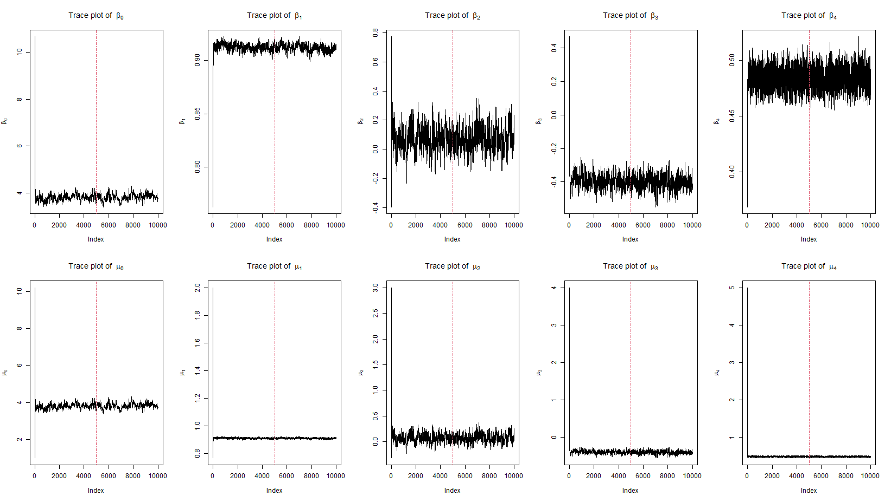

```{r setup, include=FALSE}
knitr::opts_chunk$set(echo = TRUE)
```


The suggested Bayesian model 

$$Y_{i}(t+6) =\beta_{0,i}+\beta_{1,i}Y_{i}(t) + \beta_{2,i}\Delta_{i,1}(t)+
\beta_{3,i}\Delta_{i,2}(t) +\beta_{4,i}\Delta_{i,3}(t)  + \epsilon_{i}(t)$$  

where $Y_{i}(t)$ the wind speed at time $t$ (i.e. 6 hours earlier),  $\Delta_{i,1}(t)$, $\Delta_{i,2}(t)$ and $\Delta_{i,3}(t)$ are the changes of latitude, longitude and wind speed between $t$ and $t-6$, and $\epsilon_{i,t}$ follows a  normal distributions with mean zero and variance $\sigma^2$, independent across $t$. 

In the model,  $\boldsymbol{\beta}_{i} =  (\beta_{0,i},\beta_{1,i},...,\beta_{5,i})$ are the random coefficients associated the $i$th hurricane, we assume that 

$$\boldsymbol{\beta}_{i} \sim N(\boldsymbol{\mu}, \boldsymbol{\Sigma})$$

follows a multivariate normal distributions with mean $\boldsymbol{\mu}$ and covariance matrix $\Sigma$.

We assume the following non-informative or weak prior distributions for $\sigma^2$, $\boldsymbol{\mu}$ and $\Sigma$.

$$P(\sigma^2) \propto \frac{1}{\sigma^2};\quad P(\boldsymbol{\mu})\propto 1;\quad P(\Sigma^{-1}) \propto 
|\Sigma|^{-(d+1)} \exp(-\frac{1}{2}\Sigma^{-1})$$

$d$ is dimension of $\beta$.

\newpage

## Posterior Distributions

Let $\textbf{B} = (\boldsymbol{\beta}_1^\top,..., \boldsymbol{\beta}_n^\top)^\top$, derive the posterior distribution of the parameters $\Theta = (\textbf{B}^\top, \boldsymbol{\mu}^\top, \sigma^2, \Sigma)$.

Let

$$\boldsymbol{X}_i(t)\boldsymbol{\beta}_i^\top = \beta_{0,i} + \beta_{1,i}Y_i(t) + \beta_{2,i}\Delta_{i,1}(t) + \beta_{3,i}\Delta_{i,2}(t) + \beta_{4,i}\Delta_{i,3}(t)$$
where $\boldsymbol{X}_i(t) = (1, Y_i(t), \Delta_{i,1}(t), \Delta_{i,2}(t), \Delta_{i,3}(t))$, $\boldsymbol{\beta}_i = (\beta_{0,i}, \beta_{1,i}, \beta_{2,i}, \beta_{3,i}, \beta_{4,i})$

then, we can find that
$$Y_i(t+6) {\sim} N(\boldsymbol{X}_i(t)\boldsymbol{\beta}_i^\top, \sigma^2)$$

For $i^{th}$ hurricane, there may be $m_i$ times of record (excluding the first and second observation), let
$$\boldsymbol{Y}_i = 
\begin{pmatrix}
Y_i(t_0+6)\\
Y_i(t_1+6)\\
\vdots\\
Y_i(t_{m_i-1}+6)
\end{pmatrix}_{m_i\times 1}
$$
denotes the $m_i$-dimensional result vector for the $i^{th}$ hurricane
Therefore, since $Y_i(t)$'s are independent across $t$, we can show that the conditional distribution of $\boldsymbol{Y}_i$ is

$$\boldsymbol{Y}_i \mid \boldsymbol{X}_i, \boldsymbol{\beta}_i, \sigma^2 \sim N(\boldsymbol{X}_i\boldsymbol{\beta}_i^\top, \sigma^2 I)$$

where 
$$
\boldsymbol{X}_i = 
\begin{pmatrix}
1 & Y_i(t_0)& \Delta_{i,1}(t_0) &\Delta_{i,2}(t_0) &\Delta_{i,3}(t_0)\\
1 & Y_i(t_1)& \Delta_{i,1}(t_1) &\Delta_{i,2}(t_1) &\Delta_{i,3}(t_1)\\
\vdots&\vdots&\vdots&\vdots&\vdots\\
1 & Y_i(t_{m_i-1})& \Delta_{i,1}(t_{m_i-1}) &\Delta_{i,2}(t_{m_i-1}) &\Delta_{i,3}(t_{m_i-1})
\end{pmatrix}_{m_i\times d}
$$ 

and the pdf of $\boldsymbol{Y}_i$ is
$$
\begin{aligned}
f(\boldsymbol{Y}_i\mid\boldsymbol{\beta}_i,  \sigma^2 ) = &  \det(2\pi\sigma^2 I_{(m_i\times m_i)})^{-\frac{1}{2}} \exp\{-\frac{1}{2}(\boldsymbol{Y}_i - \boldsymbol{X}_i\boldsymbol{\beta}_i^\top)^\top (\sigma^2 I_{(m_i\times m_i)})^{-1}(\boldsymbol{Y}_i - \boldsymbol{X}_i\boldsymbol{\beta}_i^\top)\}\\
= & (2\pi\sigma^2)^{-m_i/2} \exp\big\{-\frac{1}{2}(\boldsymbol{Y}_i - \boldsymbol{X}_i\boldsymbol{\beta}_i^\top)^\top (\sigma^2 I_{(m_i\times m_i)})^{-1}(\boldsymbol{Y}_i - \boldsymbol{X}_i\boldsymbol{\beta}_i^\top)\big\}
\end{aligned}
$$
Since
$$\boldsymbol{\beta}_{i} \sim N(\boldsymbol{\mu}, \boldsymbol{\Sigma})$$

Therefore the pdf of $\boldsymbol{\beta}_{i}$ is
$$\pi(\boldsymbol{\beta}_i \mid \boldsymbol{\mu},  \boldsymbol{\Sigma}) = \det(2\pi\boldsymbol{\Sigma})^{-\frac{1}{2}} \exp(-\frac{1}{2}(\boldsymbol{\beta}_i - \boldsymbol{\mu}) \boldsymbol{\Sigma}^{-1}(\boldsymbol{\beta}_i - \boldsymbol{\mu})^\top) $$
Notice that $\textbf{B} = (\boldsymbol{\beta}_1^\top,..., \boldsymbol{\beta}_n^\top)^\top$, i.e.
$$
\textbf{B} = 
\begin{pmatrix}
\beta_{0,1}&\beta_{1,1}&\beta_{2,1}& \beta_{3,1}&\beta_{4,1}\\
\beta_{0,2}&\beta_{1,2}&\beta_{2,2}& \beta_{3,2}&\beta_{4,2}\\
\vdots&\vdots&\vdots&\vdots&\vdots\\
\beta_{0,n}&\beta_{1,n}&\beta_{2,n}& \beta_{3,n}&\beta_{4,n}
\end{pmatrix}_{n\times d}
$$


So, by using Bayesian rule, we can show the posterior distribution of $\boldsymbol{\Theta}$ is,

$$
\begin{aligned}
\pi(\boldsymbol{\Theta} |\boldsymbol{Y}) =\pi(\textbf{B}^\top, \boldsymbol{\mu}^\top, \sigma^2, \boldsymbol{\Sigma}\mid Y) &\propto \prod\limits_{i=1}^{n} f(\boldsymbol{Y}_i\mid\boldsymbol{\beta}_i,  \sigma^2 )\prod\limits_{i=1}^{n}\pi(\boldsymbol{\beta}_i \mid \boldsymbol{\mu},  \boldsymbol{\Sigma})P(\sigma^2)P(\boldsymbol{\mu})P(\boldsymbol{\Sigma}^{-1})\\
&\propto \prod_{i=1}^n \Big\{(2\pi\sigma^2)^{-m_i/2} \exp\big\{-\frac{1}{2}(\boldsymbol{Y}_i - \boldsymbol{X}_i\boldsymbol{\beta}_i^\top)^\top (\sigma^2 I)^{-1}(\boldsymbol{Y}_i - \boldsymbol{X}_i\boldsymbol{\beta}_i^\top)\big\}\Big\} \\ 
& \times \prod_{i=1}^n \Big\{\det(2\pi\boldsymbol{\Sigma})^{-\frac{1}{2}} \exp\big\{-\frac{1}{2}(\boldsymbol{\beta}_i - \boldsymbol{\mu}) \boldsymbol{\Sigma}^{-1}(\boldsymbol{\beta}_i - \boldsymbol{\mu})^\top\big\}\Big\} \times \frac{1}{\sigma^2} \times \det(\boldsymbol{\boldsymbol{\Sigma}})^{-(d+1)} \exp\big\{-\frac{1}{2}\boldsymbol{\Sigma}^{-1}\big\}
\end{aligned}
$$

## Markov chain Monte Carlo Algorithm to Generate the posterior distribution

Due to the high-dimensional problem of the full joint posterior distribution, considering the computational complexity plus we actually well know the form of the joint posterior, we suggest to use Gibbs sampling algorithm instead of Metropolis-Hastings algorithm.

To apply MCMC using Gibbs sampling, we need to find conditional posterior distribution of each parameter, then we can implement Gibbs sampling on these conditional posterior distributions.

Since our suggested model mainly focus on the parameter $\textbf{B}$, we decided to derive its conditional posterior distribution.

1. The posterior distribution of $\textbf{B}$

Since finding the posterior distribution of $\textbf{B}$ is the same to find the posterior distribution of $\boldsymbol{\beta_i}$, we try to derive the conditional distribution $\pi(\boldsymbol{\beta}_i | \boldsymbol{Y}, \boldsymbol{\mu}^\top, \sigma^2, \boldsymbol{\Sigma})$

$$
\begin{aligned}
\pi(\textbf{B} | \boldsymbol{Y}, \boldsymbol{\mu}^\top, \sigma^2, \boldsymbol{\Sigma}) &\propto L_{Y}(\textbf{B}^\top,  \sigma^2 ) \times \pi(\textbf{B}
\mid \boldsymbol{\mu}, \boldsymbol{\Sigma})\\
& \propto \prod_{i=1}^nf(\boldsymbol{Y}_i\mid\boldsymbol{\beta}_i,  \sigma^2 )\prod_{i=1}^n\pi(\boldsymbol{\beta}_i \mid \boldsymbol{\mu},  \boldsymbol{\Sigma}) \\
& \propto \prod_{i=1}^n \Big\{(2\pi\sigma^2)^{-m_i/2} \exp\Big(-\frac{1}{2}(\boldsymbol{Y}_i - \boldsymbol{X}_i\boldsymbol{\beta}_i^\top)^\top (\sigma^2 I)^{-1}(\boldsymbol{Y}_i - \boldsymbol{X}_i\boldsymbol{\beta}_i^\top)\Big)\Big\} \\
& \times \prod_{i=1}^n \Big\{\det(2\pi\boldsymbol{\Sigma})^{-\frac{1}{2}} \exp(-\frac{1}{2}(\boldsymbol{\beta}_i - \boldsymbol{\mu}) \boldsymbol{\Sigma}^{-1}(\boldsymbol{\beta}_i - \boldsymbol{\mu})^\top) \Big\} \\
& \propto \prod_{i=1}^n\exp\{-\frac{1}{2}\Big((\boldsymbol{Y}_i - \boldsymbol{X}_i\boldsymbol{\beta}_i^\top)^\top (\sigma^2 I)^{-1}(\boldsymbol{Y}_i - \boldsymbol{X}_i\boldsymbol{\beta}_i^\top)+(\boldsymbol{\beta}_i - \boldsymbol{\mu}) \boldsymbol{\Sigma}^{-1}(\boldsymbol{\beta}_i - \boldsymbol{\mu})^\top)\Big)\}\\
&= \exp\{-\frac{1}{2}\Big(\boldsymbol{Y}_i^\top(\sigma^2 I)^{-1}\boldsymbol{Y}_i +\boldsymbol{\beta}_i\boldsymbol{X}_i^\top(\sigma^2 I)^{-1}\boldsymbol{X}_i\boldsymbol{\beta}_i^\top - \boldsymbol{Y}_i^\top(\sigma^2 I)^{-1}\boldsymbol{X}_i\boldsymbol{\beta}_i^\top \\
& -\boldsymbol{\beta}_i\boldsymbol{X}_i^\top(\sigma^2 I)^{-1}\boldsymbol{Y}_i+ \boldsymbol{\beta}_i\boldsymbol{\Sigma}^{-1}\boldsymbol{\beta}_i^\top+\boldsymbol{\mu}\boldsymbol{\Sigma}^{-1}\boldsymbol{\mu}^\top - \boldsymbol{\mu}\boldsymbol{\Sigma}^{-1}\boldsymbol{\beta}_i^\top- \boldsymbol{\beta}_i\boldsymbol{\Sigma}^{-1}\boldsymbol{\mu}^\top\Big)\} \\ 
& = \exp\{-\frac{1}{2}\Big(\boldsymbol{\beta}_i(\boldsymbol{\Sigma}^{-1} + \boldsymbol{X}_i^\top(\sigma^2 I)^{-1}\boldsymbol{X}_i)\boldsymbol{\beta}_i^\top- 2(\boldsymbol{Y}_i^\top(\sigma^2 I)^{-1}\boldsymbol{X}_i+\boldsymbol{\mu}\boldsymbol{\Sigma}^{-1})\boldsymbol{\beta}_i^\top+ \boldsymbol{C}\Big)\}
\end{aligned}$$


where,
$$\boldsymbol{C}  = \boldsymbol{Y}_i^\top(\sigma^2 I)^{-1}\boldsymbol{Y}_i +\boldsymbol{\mu}\boldsymbol{\Sigma}^{-1}\boldsymbol{\mu}^\top$$

By re-writing the conditional posterior distribution, and ignoring some constant terms, we can show that

$$\pi(\textbf{B} |\boldsymbol{Y}, \boldsymbol{\mu}^\top, \sigma^2, \boldsymbol{\Sigma})\propto  \prod_{i=1}^n\exp\{ (\boldsymbol{\beta}_i^\top-\hat{\boldsymbol{\beta}}_i)^\top(\hat{\boldsymbol{\Sigma}}_{{\boldsymbol{\beta}}_i})^{-1}(\boldsymbol{\beta}_i^\top-\hat{\boldsymbol{\beta}}_i)\}$$
Hence, each $\boldsymbol{\beta}_i$ has a conditional posterior multivariate normal distribution

$$\pi(\boldsymbol{\beta}_i |\boldsymbol{Y}, \boldsymbol{\mu}^\top, \sigma^2, \boldsymbol{\Sigma})\sim \\ \mathcal{N}(\hat{\boldsymbol{\beta}}_i, \hat{\boldsymbol{\Sigma}}_{{\boldsymbol{\beta}}_i})
$$
where
$$
\begin{aligned}
\hat{\boldsymbol{\beta}}_i &= (\boldsymbol{\Sigma}^{-1} + \boldsymbol{X}_i^\top(\sigma^2 I)^{-1}\boldsymbol{X}_i)^{-1}\boldsymbol{Y}_i^\top(\sigma^2 I)^{-1}\boldsymbol{X}_i+\boldsymbol{\mu}\boldsymbol{\Sigma}^{-1}\\
\hat{\boldsymbol{\Sigma}}_{{\boldsymbol{\beta}}_i} & = (\boldsymbol{\Sigma}^{-1} + \boldsymbol{X}_i^\top(\sigma^2 I)^{-1}\boldsymbol{X}_i)^{-1}
\end{aligned}
$$


2. The posterior distribution of $\pi(\sigma^2|\boldsymbol{Y},\textbf{B}^\top, \boldsymbol{\mu}^\top,\boldsymbol{\Sigma})$

\begin{align*}
\pi(\sigma^2|\boldsymbol{Y},\textbf{B}^\top, \boldsymbol{\mu}^\top,\boldsymbol{\Sigma}) & \propto L_{Y}(\textbf{B}^\top,  \sigma^2 ) \times \pi(\boldsymbol{\sigma}^2) \\
& \propto \frac{1}{\sigma^2} \prod_{i=1}^n \Big\{(2\pi\sigma^2)^{-m_i/2} \exp\Big(-\frac{1}{2}(\boldsymbol{Y}_i - \boldsymbol{X}_i\boldsymbol{\beta}_i^\top)^\top (\sigma^2 I)^{-1}(\boldsymbol{Y}_i - \boldsymbol{X}_i\boldsymbol{\beta}_i^\top)\Big)\Big\}\\
& \propto {\frac{1}{\sigma^2}}(\frac{\sum\limits_{i=1}^{n} m_i}{2}+1) \exp\{-\frac{1}{2\sigma^2}\sum\limits_{i=1}^{n}(\boldsymbol{Y}_i - \boldsymbol{X}_i\boldsymbol{\beta}_i^\top)^\top(\boldsymbol{Y}_i - \boldsymbol{X}_i\boldsymbol{\beta}_i^\top) \}
\end{align*}

which follows the form of pdf of inverse gamma distribution

$$
f(x;\alpha,\beta) = \frac{\beta^{\alpha}}{\Gamma(\alpha)}\frac{1}{x}\exp\{-\frac{\beta}{x}\}
$$
in this case, $x$ is replaced by $\sigma^2$, $\alpha$ is replaced by $\frac{1}{2}\sum\limits_{i=1}^{n} m_i$, $\beta$ is replaced by $\frac{1}{2}\sum\limits_{i=1}^{n}(\boldsymbol{Y}_i - \boldsymbol{X}_i\boldsymbol{\beta}_i^\top)^\top(\boldsymbol{Y}_i - \boldsymbol{X}_i\boldsymbol{\beta}_i^\top)$ 

i.e.

$$\pi(\sigma^2|\boldsymbol{Y},\textbf{B}^\top, \boldsymbol{\mu}^\top,\boldsymbol{\Sigma})\sim IG(\frac{1}{2}\sum\limits_{i=1}^{n} m_i,\frac{1}{2}\sum\limits_{i=1}^{n}(\boldsymbol{Y}_i - \boldsymbol{X}_i\boldsymbol{\beta}_i^\top)^\top(\boldsymbol{Y}_i - \boldsymbol{X}_i\boldsymbol{\beta}_i^\top))$$
3. The posterior distribution of $\pi(\boldsymbol{\Sigma} |\boldsymbol{Y},\textbf{B}^\top , \boldsymbol{\mu}^\top,\boldsymbol{\sigma^2})$

\begin{align*}
\pi(\boldsymbol{\Sigma} |\boldsymbol{Y},\textbf{B}^\top , \boldsymbol{\mu}^\top,\boldsymbol{\sigma^2})  \propto &  \pi(\textbf{B} \mid \boldsymbol{\mu}, \boldsymbol{\Sigma})\pi(\boldsymbol{\Sigma}^{-1}) \\
\propto & \prod_{i=1}^n \Big\{\det(2\pi\boldsymbol{\Sigma})^{-\frac{1}{2}} \exp(-\frac{1}{2}(\boldsymbol{\beta}_i - \boldsymbol{\mu}) \boldsymbol{\Sigma}^{-1}(\boldsymbol{\beta}_i - \boldsymbol{\mu})^\top) \Big\}|\Sigma|^{-(d+1)} \exp(-\frac{1}{2}\Sigma^{-1}) \\
\propto & |\Sigma|^{-(n+d+1+d+1)/2}\exp\{-\frac{1}{2}(\boldsymbol{\beta}_i - \boldsymbol{\mu}) \boldsymbol{\Sigma}^{-1}(\boldsymbol{\beta}_i - \boldsymbol{\mu})^\top-\frac{1}{2}\Sigma^{-1}\}\\
\propto & |\Sigma|^{-(n+d+1+d+1)/2}\exp\{-\frac{1}{2}tr(\boldsymbol{S}\boldsymbol{\Sigma}^{-1}) \}
\end{align*}

where
$$\boldsymbol{S} = \boldsymbol{I}+\sum\limits_{i=1}^{n}(\boldsymbol{\beta}_i - \boldsymbol{\mu})(\boldsymbol{\beta}_i - \boldsymbol{\mu})^\top$$
which is the form of pdf of the inverse wishart distribution Inverse Wishart$(\textbf{V},\boldsymbol{S})$, where $\textbf{V} = n+d+1$, i.e.

$$\pi(\boldsymbol{\Sigma} |\boldsymbol{Y},\textbf{B}^\top , \boldsymbol{\mu}^\top,\boldsymbol{\sigma^2})\sim IW(n+d+1,\  \boldsymbol{I}+\sum\limits_{i=1}^{n}(\boldsymbol{\beta}_i - \boldsymbol{\mu})(\boldsymbol{\beta}_i - \boldsymbol{\mu})^\top)$$
4. The posterior distribution of $\pi(\boldsymbol{\mu} | \boldsymbol{Y},\textbf{B}^\top  ,\boldsymbol{\sigma^2}, \boldsymbol{\Sigma})$

$$
\begin{aligned}
\pi(\boldsymbol{\mu} | \boldsymbol{Y},\textbf{B}^\top  ,\boldsymbol{\sigma^2}, \boldsymbol{\Sigma})\propto & \pi(\textbf{B} \mid \boldsymbol{\mu}, \boldsymbol{\Sigma})\pi(\boldsymbol{\mu}) \\
= & \prod_{i=1}^n \Big\{\det(2\pi\boldsymbol{\Sigma})^{-\frac{1}{2}} \exp(-\frac{1}{2}(\boldsymbol{\beta}_i - \boldsymbol{\mu}) \boldsymbol{\Sigma}^{-1}(\boldsymbol{\beta}_i - \boldsymbol{\mu})^\top) \Big\}\\
\propto &\ \exp\{-\frac{1}{2}\sum\limits_{i=1}^{n}(\boldsymbol{\beta}_i - \boldsymbol{\mu}) \boldsymbol{\Sigma}^{-1}(\boldsymbol{\beta}_i - \boldsymbol{\mu})^\top\} \\ 
\propto &\  \exp\{-\frac{1}{2}\Big(\sum\limits_{i=1}^{n}\boldsymbol{\beta}_i\ \boldsymbol{\Sigma}^{-1}\boldsymbol{\beta}_i^\top + n\boldsymbol{\mu}\boldsymbol{\Sigma}^{-1}\boldsymbol{\mu}^\top-2\sum\limits_{i=1}^{n}\boldsymbol{\beta}_i\boldsymbol{\Sigma}^{-1}\boldsymbol{\mu}^\top\Big)\} \\
= & \ \exp\{-\frac{1}{2}\Big(\boldsymbol{\mu}(n\boldsymbol{\Sigma}^{-1})\boldsymbol{\mu}^\top - 2(\sum\limits_{i=1}^{n}\boldsymbol{\beta}_i\boldsymbol{\Sigma}^{-1})\boldsymbol{\mu}^\top +\boldsymbol{C'}\Big)\}\\
\propto & \ \exp\{-\frac{1}{2}(\boldsymbol{\mu}-\frac{1}{n}\sum\limits_{i=1}^{n}\boldsymbol{\beta}_i)(n\boldsymbol{\Sigma}^{-1})(\boldsymbol{\mu}-\frac{1}{n}\sum\limits_{i=1}^{n}\boldsymbol{\beta}_i)^\top\}
\end{aligned}
$$

where

$$
\boldsymbol{C'} =  \sum\limits_{i=1}^{n}\boldsymbol{\beta}_i\ \boldsymbol{\Sigma}^{-1}\boldsymbol{\beta}_i^\top
$$
Hence

$$\pi(\boldsymbol{\mu} | \boldsymbol{Y},\textbf{B}^\top  ,\boldsymbol{\sigma^2}, \boldsymbol{\Sigma})\sim \mathcal{N}(\frac{1}{n}\sum\limits_{i=1}^{n}\boldsymbol{\beta}_i,\frac{1}{n}\boldsymbol{\Sigma})$$

## Markov Chain Monte Carlo

Because our hierarchical Bayesian Model exploited non-informative priors for four parameters, the Gibbs Sampling method would be implemented, updating parameters in the following order from their conditional posteriors distributions, $\textbf{B},\ \sigma^2,\ \boldsymbol{\Sigma}$ and $\boldsymbol{\mu}$.

## Algorithm Implemtation and Estimation

Since we have derived the conditional posterior of the four parameters, we implemented Gibbs sampling algorithm, updating parameters by randomly generating samples from their conditional posterior distributions.

The update of parameters is component wise, at $(t+1)^\text{th}$ step, updating parameters in the following the order:

* Sample $\textbf{B}^{(t+1)}$, i.e., sample each $\boldsymbol{\beta}_i^{(t+1)}$ from $\mathcal{N}(\hat{\boldsymbol{\beta}}_i^{(t)},\hat{\boldsymbol{\Sigma}}_{{\boldsymbol{\beta}}_i}^{(t)})$

* Then, sample $\sigma^2$ from $IG(\frac{1}{2}\sum\limits_{i=1}^{n} m_i,\frac{1}{2}\sum\limits_{i=1}^{n}(\boldsymbol{Y}_i - \boldsymbol{X}_i{\boldsymbol{\beta}_i^{(t+1)}}^\top)^\top(\boldsymbol{Y}_i - \boldsymbol{X}_i{\boldsymbol{\beta}_i^{(t+1)}}^\top))$

* Next, sample $\boldsymbol{\Sigma}^{(t+1)}$ from $IW(n+d+1,\  \boldsymbol{I}+\sum\limits_{i=1}^{n}({\boldsymbol{\beta}_i}^{(t+1)} - \boldsymbol{\mu}^{(t)})({\boldsymbol{\beta}_i}^{(t+1)} - \boldsymbol{\mu}^{(t)})^\top)$

* Finally, sample $\boldsymbol{\mu}^{(t+1)}$ from $\mathcal{N}(\frac{1}{n}\sum\limits_{i=1}^{n}{\boldsymbol{\beta}_i}^{(t+1)},\frac{1}{n}{\boldsymbol{\Sigma}}^{(t+1)})$

### Inital Values

For a good performance and to speed up the convergence of our algorithm, also keep some uncertainty in the MCMC process, we delicately designed the initial values.

For initial value of $\textbf{B}$, we run multivariate linear regressions for each hurricane and use the regression coefficients $\boldsymbol{\beta}_i^{MLR}$ as the initial value for $\boldsymbol{\beta_i}$. Then, the initial value of $\textbf{B}$ can be represented as $\textbf{B}_{init} = ({\boldsymbol{\beta}_1^{MLR}}^\top,\dots,{\boldsymbol{\beta}_n^{MLR}}^\top)^\top$.

For initial value of $\boldsymbol{\mu}$, we take the average of ${\boldsymbol{\beta}_i^{MLR}}$, that is $\boldsymbol{\mu}_{init}= \frac{1}{n}\sum\limits_{i=1}^n{\boldsymbol{\beta}_n^{MLR}}$

For initial value of $\sigma^2$, we take the average of the MSE for $i$ hurricanes.

For initial value of $\boldsymbol{\Sigma}$, we just set it to a simple diagonal matrix, i.e. $\boldsymbol{\Sigma}_{init} = diag(1,2,3,4,5)$

\newpage

### MCMC Results

#### Trace plots

```{r trace_mcmc, echo=FALSE, fig.cap="Trace plots of selected parameters, based on 10000 MCMC sample", out.width = '90%', fig.align='center'}

```

#### Histograms

```{r hist_mcmc, echo=FALSE, fig.cap="Histograms of selected parameters, based on last 5000 MCMC sample", out.width = '90%', fig.align='center'}
knitr::include_graphics("./plots/mcmc_hist.jpg")
```

#### Estimates


```{r}
load("./param_summary.RData")
```


```{r loglik_functions, echo=FALSE}
# betavec: 1*5
# sigma2: 1*1
# mu: 1*5
# Sigma: 5*5

# d = 5
# n = 702


loglik_sigma2 <- function(sigma2){
    if (sigma2 <= 0) {
        return(-Inf)
    } else {
        return(log(1/sigma2^2))  
    }
    
}

loglik_Sigma <- function(Sigma, d){
    if (min(eigen(Sigma)$values) <= 0) {
        return(-Inf)
    } else {
        loglik = log(det(Sigma)^(-(d+1))*exp(-(1/2)*solve(Sigma)))
        return(loglik)
    }
}

# log likelihood for y given a specific hurricane's data given sigma2 and betavec
loglik_Y <- function(y, X, betavec, sigma2){
    m = length(y)
    loglik = (2*pi*sigma2^2)^(-(m/2))*exp(-(1/2)*t(X %*% t(betavec)) %*% solve(diag(sigma2, m)) %*% (X %*% t(betavec))) 
    loglik = log(loglik)
    return(loglik)
    
}

# log likelihood for betavec given a specific hurricane's mu and Sigma

loglik_betavec <- function(betavec, mu, Sigma){
    if (min(eigen(Sigma)$values) <= 0) {
        return(-Inf)
    } else {
        loglik = log(det(2*pi*Sigma)^(-(1/2))*exp(-(1/2)*(betavec - mu) %*% solve(Sigma) %*% t(betavec - mu)))
        return(loglik)
    }
}

```


