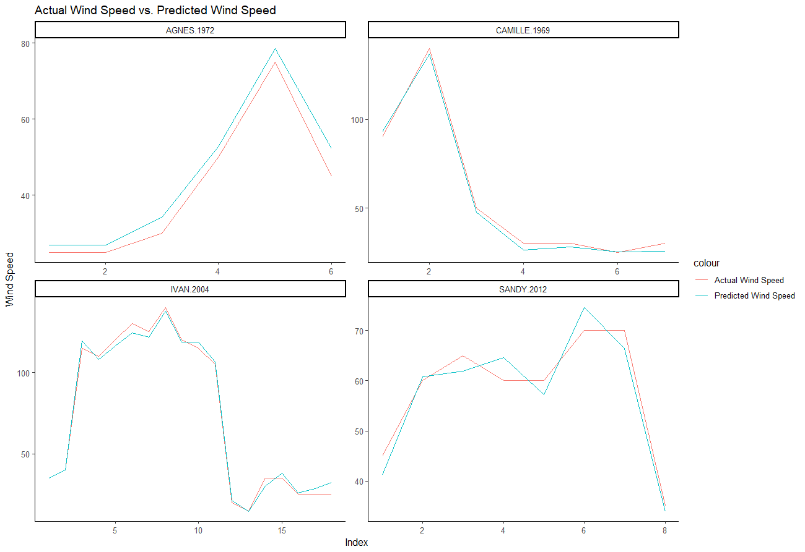
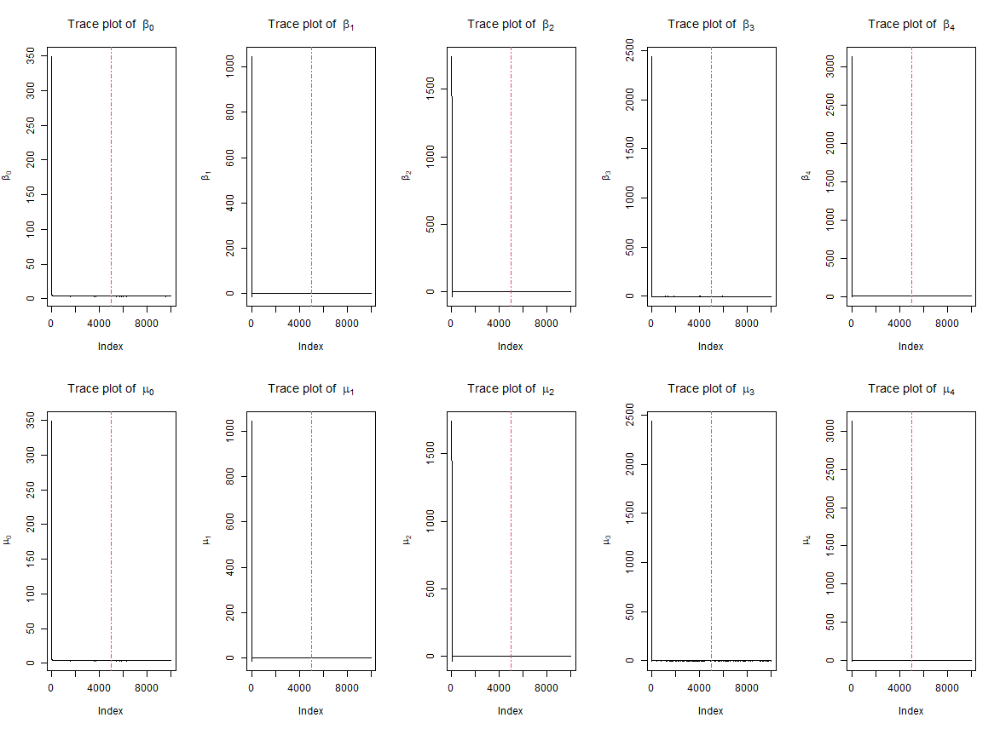

```{r setup, include=FALSE}
knitr::opts_chunk$set(echo = TRUE, warning = F, message = F)
```

## 1. Introduction
  
### 1.1 Background and Objectives 

  Hurricanes are a serious social and economic concern to the United States. Strong winds, heavy rainfall, and high storm surge kill people and destroy property. There is an increasing desire to predict the performance of hurricane, such as its location, speed and so on. In this project, we are interested in modeling the hurricane trajectories to forecast the wind speed achieved by Hierarchical Bayesian Model. The hurricane data contains individual-level-specific effects of each hurricane. Model integration is achieved through a Markov Chain Monte Carlo algorithm.
  
  Also, we present work that is to describe the seasonal difference based on the previous estimated Bayesian model and try to find if there is any evidence supporting that the hurricane wind speed has been increasing over years. Finally, we use additional data which includes the damages and death caused by hurricanes in the United States to build a prediction model. We wish to find the most important factors that affect hurricanes and draw inferences and conclusions based on the model.

\newpage

## 2 Data Cleaning and Explorative Data Analysis

### 2.1 Dataset
hurrican703.csv collected the track data of 702 hurricanes in  the North Atlantic area from 1950 to 2013. For all the storms, their location (longitude \& latitude) and maximum wind speed were recorded every 6 hours. The data includes the following variables 

1. **ID**:  ID of the hurricans

2. **Season**: In which \textbf{year} the hurricane occurred

3. **Month**: In which \textbf{month} the hurricane occurred 

4. **Nature**:  Nature of the hurricane 
  + ET: Extra Tropical
  + DS: Disturbance
  + NR: Not Rated
  + SS: Sub Tropical
  + TS: Tropical Storm
5. **time**: dates and time of the record  

6. **Latitude** and **Longitude**:  The location of  a hurricane check point 

7. **Wind.kt**  Maximum wind speed (in Knot) at each check point 

From the original dataset, we built a new dataset with contains five more variables, including:

1. **Wind_prev**: wind speed at 6 hours ago

2. **Wind_prev_prev**: wind speed at 12 hours ago

3. **Lat_change**: latitude change compared to 6 hours earlier

4. **Long_change**: longitude change compared to 6 hours earlier

5. **Wind_change**: wind speed change at 6 hours earlier compared to 12 hours earlier

These variables will help us to build the model in the following part.

The $hurricanoutcome2.csv$ recorded the damages and death caused by 46 hurricanes in the U.S, and some features extracted from the hurricane records. The variables include:

1. **ID**: ID of the hurricans
    
2. **Season**: In which \textbf{year} the hurricane occurred 
    
3. **Month**: In which \textbf{month} the hurricane occurred 
    
4. **Nature**: Nature of the hurricane 
    + ET: Extra Tropical
    + DS: Disturbance
    + NR: Not Rated
    + SS: Sub Tropical
    + TS: Tropical Storm
      
5. **Damage**: Financial loss (in Billion U.S. dollars) caused by hurricanes
    
6. **Deaths**: Number of death caused by hurricanes
    
7. **Maxspeed**: Maximum recorded wind speed of the hurricane
    
8. **Meanspeed**: average  wind speed of the hurricane
    
9. **Maxpressure**: Maximum recorded central pressure of the hurricane
    
10. **Meanpressure**: average central pressure of the hurricane
    
11. **Hours**: Duration of the hurricane in hours 
    
12. **Total.Pop**: Total affected population   
    
13. **Percent.Poor**: % affected population that reside in low GDP countres (i.e. GDP per Capita $<=$ 10,000)  
    
14. **Percent.USA**: % affected population that reside in the United States  

### 2.2 EDA

```{r, include = FALSE}
library(ggplot2)
dt= read.csv("./hurrican703.csv")
library(data.table)
dt <- as.data.table(dt)
summary(dt)

library(tidyverse)
dt_long <- dt %>%
    dplyr::group_by(ID) %>% 
    mutate(Wind_prev = lag(Wind.kt, 1),
           Lat_change = Latitude - lag(Latitude, 1),
           Long_change = Longitude - lag(Longitude, 1),
           Wind_prev_prev = lag(Wind.kt, 2)) %>% 
    mutate(Wind_change = Wind_prev - Wind_prev_prev)
```

We use a bar plot to examine the number of hurricanes in each month. From Figure 1, we can see that September is the month with the most hurricanes, while there are no hurricanes in February and March. Hurricanes in September also have the highest average wind speed as we can see in Figure 2. 

```{r, echo=FALSE, fig1, fig.height=4, fig.width=7}
storms_month_name = distinct(group_by(select(dt_long, Month, ID), Month))

storms_month_name %>% 
  dplyr::group_by(Month) %>% 
  mutate(Month =  factor(Month, levels = month.name)) %>%  
  ggplot(aes(x = Month)) +
  geom_bar()
```
\begin{center}
Figure 1. Count of Hurricanes in Each Month
\end{center}

```{r, echo=FALSE, fig2, fig.height=4, fig.width=7}
dt_long %>% 
  dplyr::group_by(Month) %>% 
  mutate(avg_speed = mean(Wind.kt)) %>% 
  distinct(Month, avg_speed) %>% 
  mutate(Month =  factor(Month, levels = month.name))%>% 
  ggplot(aes(x = Month, y = avg_speed)) +
  geom_point() +
  scale_y_continuous("Average Speed (knot)")
```
\begin{center}
Figure 2. Average Speed (knot) of Hurricanes in Each Month
\end{center}
If we group the hurricanes by years, we can see in general, we have more observations in recently years compared to 50 years ago as shown in Figure 3. However, from Figure 4, the average wind speed seems to have a decreasing trend.

```{r, echo=FALSE, fig3, fig.height=3.8, fig.width=7}
storms_season_name = distinct(group_by(select(dt_long, Season, ID), Season))
ggplot(data = storms_season_name) + 
  geom_bar(aes(x = Season)) +
  scale_x_continuous("Year")
```
\begin{center}
Figure 3. Count of Hurricanes in Each Year
\end{center}
```{r, echo=FALSE, fig4, fig.height=3.8, fig.width=7}
dt_long %>% 
  dplyr::group_by(Season) %>% 
  mutate(avg_speed = mean(Wind.kt)) %>% 
  distinct(Season, avg_speed) %>% 
  ggplot(aes(x = Season, y = avg_speed)) +
  geom_point() +
  geom_smooth(method = "loess") +
  scale_y_continuous("Average Speed (knot)") +
  scale_x_continuous("Year") 
```
\begin{center}
Figure 4. Average Speed (knot) of Hurricanes in Each Year
\end{center}
We also compare the hurricanes with different natures. In our dataset, there are 1214 different nature ratings. This number is larger than the number of hurricanes because some hurricanes are in different natures at different time. From Figure 5, we know that more than half of the natures are in Tropical Storm category. This nature also have the highest average wind speed at about 60 knot, while the disturbance and not rated hurricanes have average wind speed at round 20 knot as Figure 6 illustrates.

```{r, echo=FALSE, fig5, fig.height=3.8, fig.width=7}
storms_nature_name = distinct(group_by(select(dt_long, Nature, ID), Nature))
ggplot(data = storms_nature_name) + 
  geom_bar(aes(x = Nature))
```
\begin{center}
Figure 5. Count of Hurricanes in Each Nature
\end{center}
```{r, echo=FALSE, fig6, fig.height=3.8, fig.width=7}
dt_long %>% 
  dplyr::group_by(Nature) %>% 
  mutate(avg_speed = mean(Wind.kt)) %>% 
  distinct(Nature, avg_speed) %>% 
  ggplot(aes(x = Nature, y = avg_speed)) +
  geom_point() +
  scale_y_continuous("Average Speed (knot)")
```
\begin{center}
Figure 6. Average Speed (knot) of Hurricanes in Each Nature
\end{center}

\newpage

## 3 Bayesian Model for Hurricanes Trajectories

### 3.1 Markov Chain Monte Carlo (MCMC)

Markov Chain Monte Carlo is combined by two methods, Markov Chain and Monte Carlo Method. Monte Carlo is a random sampling method for approximating a desired quantity, whereas Markov Chain generates a sequence of random variables where the current state only depends on the nearest past in the chain. MCMC algorithm draws samples from Markov Chain successively leading us close to the desired posterior. Two commonly used MCMC algorithm are the Metropolis-Hastings Algorithm and the Gibbs Sampler. Here, we implement the Gibbs Sampler here since we can save much computation cost compared to Metropolis-Hastings Algorithm.

### 3.2 Gibbs Sampler
Gibbs Sampler is one of Bayesian MCMC approaches with known conditional distributions. By sampling from each random variables given all the others, and changing one random variable at a time, Gibbs Sampler is able to draw parameter samples from the joint distribution. Then given proper starting value, the Markov Chain can reach its stationary distribution.

### 3.3 Bayesian Hierarchical Modelling

Bayesian hierarchical modelling is a statistical model written in multiple levels (hierarchical form) that estimates the parameters of the posterior distribution using the Bayesian method. 
  
Hierarchical Bayesian Models, which contain both within-group analysis and between-group analysis, are always used to learn about a population from many individual measurements. Therefore, there is natural heterogeneity during the research periods and it could be regarded as subject-specific mean response trajectories for each individual group. To build the model, we split the inference problem into steps, where the full model is made up of a series of sub-models. The Bayesian Hierarchical Model links the sub-models together, correctly propagating uncertainties in each sub-model from one level to the next. MCMC methods work particularly well with hierarchical models, and is the engine that has fueled the development and application of Bayes' theorem. 
  
From the Bayes' theorem: $$posterior\ distribution \propto likelihood \times prior\ distribution$$
$$ {\pi(\theta| X)} \propto {\pi(X|\theta)} \times {\pi(\theta)}$$

The Hierarchical Bayes
$$ {\pi(\theta, \alpha| X)} \propto {\pi(X|\theta)} \times {\pi(\theta|\alpha)} \times {\pi(\alpha)}$$
Bayesian Inference is a statistical inference method about parameter. Proper prior distribution of parameter $\theta$ is set. After data collection, the belief of parameter $\theta$ would be updated by exploring the posterior distribution of $\theta$ based on observed data and its pre-assumed likelihood function $L(X; \theta)$. The linear regression model in hierarchical form incorporating with Bayesian inference is implemented with MCMC Integration algorithm for updating the parameter estimation in the final MCMC stationary phase.


### 3.4 Model Setting

The suggested Bayesian model 

$$Y_{i}(t+6) =\beta_{0,i}+\beta_{1,i}Y_{i}(t) + \beta_{2,i}\Delta_{i,1}(t)+
\beta_{3,i}\Delta_{i,2}(t) +\beta_{4,i}\Delta_{i,3}(t)  + \epsilon_{i}(t)$$  

where $Y_{i}(t)$ the wind speed at time $t$ (i.e. 6 hours earlier),  $\Delta_{i,1}(t)$, $\Delta_{i,2}(t)$ and $\Delta_{i,3}(t)$ are the changes of latitude, longitude and wind speed between $t$ and $t-6$, and $\epsilon_{i,t}$ follows a  normal distributions with mean zero and variance $\sigma^2$, independent across $t$. 

In the model,  $\boldsymbol{\beta}_{i} =  (\beta_{0,i},\beta_{1,i},...,\beta_{5,i})$ are the random coefficients associated the $i$th hurricane, we assume that 

$$\boldsymbol{\beta}_{i} \sim N(\boldsymbol{\mu}, \boldsymbol{\Sigma})$$

follows a multivariate normal distributions with mean $\boldsymbol{\mu}$ and covariance matrix $\Sigma$.

We assume the following non-informative or weak prior distributions for $\sigma^2$, $\boldsymbol{\mu}$ and $\Sigma$.

$$P(\sigma^2) \propto \frac{1}{\sigma^2};\quad P(\boldsymbol{\mu})\propto 1;\quad P(\Sigma^{-1}) \propto 
|\Sigma|^{-(d+1)} \exp(-\frac{1}{2}\Sigma^{-1})$$

$d$ is dimension of $\beta$.

### 3.5 Posterior Distributions

Let $\textbf{B} = (\boldsymbol{\beta}_1^\top,..., \boldsymbol{\beta}_n^\top)^\top$, derive the posterior distribution of the parameters $\Theta = (\textbf{B}^\top, \boldsymbol{\mu}^\top, \sigma^2, \Sigma)$.

Let

$$\boldsymbol{X}_i(t)\boldsymbol{\beta}_i^\top = \beta_{0,i} + \beta_{1,i}Y_i(t) + \beta_{2,i}\Delta_{i,1}(t) + \beta_{3,i}\Delta_{i,2}(t) + \beta_{4,i}\Delta_{i,3}(t)$$
where $\boldsymbol{X}_i(t) = (1, Y_i(t), \Delta_{i,1}(t), \Delta_{i,2}(t), \Delta_{i,3}(t))$, $\boldsymbol{\beta}_i = (\beta_{0,i}, \beta_{1,i}, \beta_{2,i}, \beta_{3,i}, \beta_{4,i})$

then, we can find that
$$Y_i(t+6) {\sim} N(\boldsymbol{X}_i(t)\boldsymbol{\beta}_i^\top, \sigma^2)$$

For $i^{th}$ hurricane, there may be $m_i$ times of record (excluding the first and second observation), let
$$\boldsymbol{Y}_i = 
\begin{pmatrix}
Y_i(t_0+6)\\
Y_i(t_1+6)\\
\vdots\\
Y_i(t_{m_i-1}+6)
\end{pmatrix}_{m_i\times 1}
$$
denotes the $m_i$-dimensional result vector for the $i^{th}$ hurricane
Therefore, since $Y_i(t)$'s are independent across $t$, we can show that the conditional distribution of $\boldsymbol{Y}_i$ is

$$\boldsymbol{Y}_i \mid \boldsymbol{X}_i, \boldsymbol{\beta}_i, \sigma^2 \sim N(\boldsymbol{X}_i\boldsymbol{\beta}_i^\top, \sigma^2 I)$$

where 
$$
\boldsymbol{X}_i = 
\begin{pmatrix}
1 & Y_i(t_0)& \Delta_{i,1}(t_0) &\Delta_{i,2}(t_0) &\Delta_{i,3}(t_0)\\
1 & Y_i(t_1)& \Delta_{i,1}(t_1) &\Delta_{i,2}(t_1) &\Delta_{i,3}(t_1)\\
\vdots&\vdots&\vdots&\vdots&\vdots\\
1 & Y_i(t_{m_i-1})& \Delta_{i,1}(t_{m_i-1}) &\Delta_{i,2}(t_{m_i-1}) &\Delta_{i,3}(t_{m_i-1})
\end{pmatrix}_{m_i\times d}
$$ 

and the pdf of $\boldsymbol{Y}_i$ is
$$
\begin{aligned}
f(\boldsymbol{Y}_i\mid\boldsymbol{\beta}_i,  \sigma^2 ) = &  \det(2\pi\sigma^2 I_{(m_i\times m_i)})^{-\frac{1}{2}} \exp\{-\frac{1}{2}(\boldsymbol{Y}_i - \boldsymbol{X}_i\boldsymbol{\beta}_i^\top)^\top (\sigma^2 I_{(m_i\times m_i)})^{-1}(\boldsymbol{Y}_i - \boldsymbol{X}_i\boldsymbol{\beta}_i^\top)\}\\
= & (2\pi\sigma^2)^{-m_i/2} \exp\big\{-\frac{1}{2}(\boldsymbol{Y}_i - \boldsymbol{X}_i\boldsymbol{\beta}_i^\top)^\top (\sigma^2 I_{(m_i\times m_i)})^{-1}(\boldsymbol{Y}_i - \boldsymbol{X}_i\boldsymbol{\beta}_i^\top)\big\}
\end{aligned}
$$
Since
$$\boldsymbol{\beta}_{i} \sim N(\boldsymbol{\mu}, \boldsymbol{\Sigma})$$

Therefore the pdf of $\boldsymbol{\beta}_{i}$ is
$$\pi(\boldsymbol{\beta}_i \mid \boldsymbol{\mu},  \boldsymbol{\Sigma}) = \det(2\pi\boldsymbol{\Sigma})^{-\frac{1}{2}} \exp(-\frac{1}{2}(\boldsymbol{\beta}_i - \boldsymbol{\mu}) \boldsymbol{\Sigma}^{-1}(\boldsymbol{\beta}_i - \boldsymbol{\mu})^\top) $$
Notice that $\textbf{B} = (\boldsymbol{\beta}_1^\top,..., \boldsymbol{\beta}_n^\top)^\top$, i.e.
$$
\textbf{B} = 
\begin{pmatrix}
\beta_{0,1}&\beta_{1,1}&\beta_{2,1}& \beta_{3,1}&\beta_{4,1}\\
\beta_{0,2}&\beta_{1,2}&\beta_{2,2}& \beta_{3,2}&\beta_{4,2}\\
\vdots&\vdots&\vdots&\vdots&\vdots\\
\beta_{0,n}&\beta_{1,n}&\beta_{2,n}& \beta_{3,n}&\beta_{4,n}
\end{pmatrix}_{n\times d}
$$

So, by using Bayesian rule, we can show the posterior distribution of $\boldsymbol{\Theta}$ is,

$$
\begin{aligned}
\pi(\boldsymbol{\Theta} |\boldsymbol{Y}) =\pi(\textbf{B}^\top, \boldsymbol{\mu}^\top, \sigma^2, \boldsymbol{\Sigma}\mid Y) &\propto \prod\limits_{i=1}^{n} f(\boldsymbol{Y}_i\mid\boldsymbol{\beta}_i,  \sigma^2 )\prod\limits_{i=1}^{n}\pi(\boldsymbol{\beta}_i \mid \boldsymbol{\mu},  \boldsymbol{\Sigma})P(\sigma^2)P(\boldsymbol{\mu})P(\boldsymbol{\Sigma}^{-1})\\
&\propto \prod_{i=1}^n \Big\{(2\pi\sigma^2)^{-m_i/2} \exp\big\{-\frac{1}{2}(\boldsymbol{Y}_i - \boldsymbol{X}_i\boldsymbol{\beta}_i^\top)^\top (\sigma^2 I)^{-1}(\boldsymbol{Y}_i - \boldsymbol{X}_i\boldsymbol{\beta}_i^\top)\big\}\Big\} \\ 
& \times \prod_{i=1}^n \Big\{\det(2\pi\boldsymbol{\Sigma})^{-\frac{1}{2}} \exp\big\{-\frac{1}{2}(\boldsymbol{\beta}_i - \boldsymbol{\mu}) \boldsymbol{\Sigma}^{-1}(\boldsymbol{\beta}_i - \boldsymbol{\mu})^\top\big\}\Big\} \\
&\times \frac{1}{\sigma^2} \times \det(\boldsymbol{\boldsymbol{\Sigma}})^{-(d+1)} \exp\big\{-\frac{1}{2}\boldsymbol{\Sigma}^{-1}\big\}
\end{aligned}
$$

### 3.6 Conditional Posterior Distribution

Due to the high-dimensional problem of the full joint posterior distribution, considering the computational complexity plus we actually well know the form of the joint posterior, we suggest to use Gibbs sampling algorithm instead of Metropolis-Hastings algorithm.

To apply MCMC using Gibbs sampling, we need to find conditional posterior distribution of each parameter, then we can implement Gibbs sampling on these conditional posterior distributions.

Since our suggested model mainly focus on the parameter $\textbf{B}$, we decided to derive its conditional posterior distribution.

1. The posterior distribution of $\textbf{B}$

Since finding the posterior distribution of $\textbf{B}$ is the same to find the posterior distribution of $\boldsymbol{\beta_i}$, we try to derive the conditional distribution $\pi(\boldsymbol{\beta}_i | \boldsymbol{Y}, \boldsymbol{\mu}^\top, \sigma^2, \boldsymbol{\Sigma})$

$$
\begin{aligned}
\pi(\textbf{B} | \boldsymbol{Y}, \boldsymbol{\mu}^\top, \sigma^2, \boldsymbol{\Sigma}) &\propto L_{Y}(\textbf{B}^\top,  \sigma^2 ) \times \pi(\textbf{B}
\mid \boldsymbol{\mu}, \boldsymbol{\Sigma})\\
& \propto \prod_{i=1}^nf(\boldsymbol{Y}_i\mid\boldsymbol{\beta}_i,  \sigma^2 )\prod_{i=1}^n\pi(\boldsymbol{\beta}_i \mid \boldsymbol{\mu},  \boldsymbol{\Sigma}) \\
& \propto \prod_{i=1}^n \Big\{(2\pi\sigma^2)^{-m_i/2} \exp\Big(-\frac{1}{2}(\boldsymbol{Y}_i - \boldsymbol{X}_i\boldsymbol{\beta}_i^\top)^\top (\sigma^2 I)^{-1}(\boldsymbol{Y}_i - \boldsymbol{X}_i\boldsymbol{\beta}_i^\top)\Big)\Big\} \\
& \times \prod_{i=1}^n \Big\{\det(2\pi\boldsymbol{\Sigma})^{-\frac{1}{2}} \exp(-\frac{1}{2}(\boldsymbol{\beta}_i - \boldsymbol{\mu}) \boldsymbol{\Sigma}^{-1}(\boldsymbol{\beta}_i - \boldsymbol{\mu})^\top) \Big\} \\
& \propto \prod_{i=1}^n\exp\{-\frac{1}{2}\Big((\boldsymbol{Y}_i - \boldsymbol{X}_i\boldsymbol{\beta}_i^\top)^\top (\sigma^2 I)^{-1}(\boldsymbol{Y}_i - \boldsymbol{X}_i\boldsymbol{\beta}_i^\top)+(\boldsymbol{\beta}_i - \boldsymbol{\mu}) \boldsymbol{\Sigma}^{-1}(\boldsymbol{\beta}_i - \boldsymbol{\mu})^\top)\Big)\}\\
&= \exp\{-\frac{1}{2}\Big(\boldsymbol{Y}_i^\top(\sigma^2 I)^{-1}\boldsymbol{Y}_i +\boldsymbol{\beta}_i\boldsymbol{X}_i^\top(\sigma^2 I)^{-1}\boldsymbol{X}_i\boldsymbol{\beta}_i^\top - \boldsymbol{Y}_i^\top(\sigma^2 I)^{-1}\boldsymbol{X}_i\boldsymbol{\beta}_i^\top \\
& -\boldsymbol{\beta}_i\boldsymbol{X}_i^\top(\sigma^2 I)^{-1}\boldsymbol{Y}_i+ \boldsymbol{\beta}_i\boldsymbol{\Sigma}^{-1}\boldsymbol{\beta}_i^\top+\boldsymbol{\mu}\boldsymbol{\Sigma}^{-1}\boldsymbol{\mu}^\top - \boldsymbol{\mu}\boldsymbol{\Sigma}^{-1}\boldsymbol{\beta}_i^\top- \boldsymbol{\beta}_i\boldsymbol{\Sigma}^{-1}\boldsymbol{\mu}^\top\Big)\} \\ 
& = \exp\{-\frac{1}{2}\Big(\boldsymbol{\beta}_i(\boldsymbol{\Sigma}^{-1} + \boldsymbol{X}_i^\top(\sigma^2 I)^{-1}\boldsymbol{X}_i)\boldsymbol{\beta}_i^\top- 2(\boldsymbol{Y}_i^\top(\sigma^2 I)^{-1}\boldsymbol{X}_i+\boldsymbol{\mu}\boldsymbol{\Sigma}^{-1})\boldsymbol{\beta}_i^\top+ \boldsymbol{C}\Big)\}
\end{aligned}$$


where,
$$\boldsymbol{C}  = \boldsymbol{Y}_i^\top(\sigma^2 I)^{-1}\boldsymbol{Y}_i +\boldsymbol{\mu}\boldsymbol{\Sigma}^{-1}\boldsymbol{\mu}^\top$$

By re-writing the conditional posterior distribution, and ignoring some constant terms, we can show that

$$\pi(\textbf{B} |\boldsymbol{Y}, \boldsymbol{\mu}^\top, \sigma^2, \boldsymbol{\Sigma})\propto  \prod_{i=1}^n\exp\{ (\boldsymbol{\beta}_i^\top-\hat{\boldsymbol{\beta}}_i)^\top(\hat{\boldsymbol{\Sigma}}_{{\boldsymbol{\beta}}_i})^{-1}(\boldsymbol{\beta}_i^\top-\hat{\boldsymbol{\beta}}_i)\}$$
Hence, each $\boldsymbol{\beta}_i$ has a conditional posterior multivariate normal distribution

$$\pi(\boldsymbol{\beta}_i |\boldsymbol{Y}, \boldsymbol{\mu}^\top, \sigma^2, \boldsymbol{\Sigma})\sim \\ \mathcal{N}(\hat{\boldsymbol{\beta}}_i, \hat{\boldsymbol{\Sigma}}_{{\boldsymbol{\beta}}_i})
$$
where
$$
\begin{aligned}
\hat{\boldsymbol{\beta}}_i &= (\boldsymbol{\Sigma}^{-1} + \boldsymbol{X}_i^\top(\sigma^2 I)^{-1}\boldsymbol{X}_i)^{-1}\boldsymbol{Y}_i^\top(\sigma^2 I)^{-1}\boldsymbol{X}_i+\boldsymbol{\mu}\boldsymbol{\Sigma}^{-1}\\
\hat{\boldsymbol{\Sigma}}_{{\boldsymbol{\beta}}_i} & = (\boldsymbol{\Sigma}^{-1} + \boldsymbol{X}_i^\top(\sigma^2 I)^{-1}\boldsymbol{X}_i)^{-1}
\end{aligned}
$$


2. The posterior distribution of $\pi(\sigma^2|\boldsymbol{Y},\textbf{B}^\top, \boldsymbol{\mu}^\top,\boldsymbol{\Sigma})$

$$
\begin{aligned}
\pi(\sigma^2|\boldsymbol{Y},\textbf{B}^\top, \boldsymbol{\mu}^\top,\boldsymbol{\Sigma}) & \propto L_{Y}(\textbf{B}^\top,  \sigma^2 ) \times \pi(\boldsymbol{\sigma}^2) \\
& \propto \frac{1}{\sigma^2} \prod_{i=1}^n \Big\{(2\pi\sigma^2)^{-m_i/2} \exp\Big(-\frac{1}{2}(\boldsymbol{Y}_i - \boldsymbol{X}_i\boldsymbol{\beta}_i^\top)^\top (\sigma^2 I)^{-1}(\boldsymbol{Y}_i - \boldsymbol{X}_i\boldsymbol{\beta}_i^\top)\Big)\Big\}\\
& \propto {\frac{1}{\sigma^2}}(\frac{\sum\limits_{i=1}^{n} m_i}{2}+1) \exp\{-\frac{1}{2\sigma^2}\sum\limits_{i=1}^{n}(\boldsymbol{Y}_i - \boldsymbol{X}_i\boldsymbol{\beta}_i^\top)^\top(\boldsymbol{Y}_i - \boldsymbol{X}_i\boldsymbol{\beta}_i^\top) \}
\end{aligned}$$

which follows the form of pdf of inverse gamma distribution

$$
f(x;\alpha,\beta) = \frac{\beta^{\alpha}}{\Gamma(\alpha)}\frac{1}{x}\exp\{-\frac{\beta}{x}\}
$$
in this case, $x$ is replaced by $\sigma^2$, $\alpha$ is replaced by $\frac{1}{2}\sum\limits_{i=1}^{n} m_i$, $\beta$ is replaced by $\frac{1}{2}\sum\limits_{i=1}^{n}(\boldsymbol{Y}_i - \boldsymbol{X}_i\boldsymbol{\beta}_i^\top)^\top(\boldsymbol{Y}_i - \boldsymbol{X}_i\boldsymbol{\beta}_i^\top)$ 

i.e.

$$\pi(\sigma^2|\boldsymbol{Y},\textbf{B}^\top, \boldsymbol{\mu}^\top,\boldsymbol{\Sigma})\sim IG(\frac{1}{2}\sum\limits_{i=1}^{n} m_i,\frac{1}{2}\sum\limits_{i=1}^{n}(\boldsymbol{Y}_i - \boldsymbol{X}_i\boldsymbol{\beta}_i^\top)^\top(\boldsymbol{Y}_i - \boldsymbol{X}_i\boldsymbol{\beta}_i^\top))$$
3. The posterior distribution of $\pi(\boldsymbol{\Sigma} |\boldsymbol{Y},\textbf{B}^\top , \boldsymbol{\mu}^\top,\boldsymbol{\sigma^2})$

$$
\begin{aligned}
\pi(\boldsymbol{\Sigma} |\boldsymbol{Y},\textbf{B}^\top , \boldsymbol{\mu}^\top,\boldsymbol{\sigma^2})  \propto &  \pi(\textbf{B} \mid \boldsymbol{\mu}, \boldsymbol{\Sigma})\pi(\boldsymbol{\Sigma}^{-1}) \\
\propto & \prod_{i=1}^n \Big\{\det(2\pi\boldsymbol{\Sigma})^{-\frac{1}{2}} \exp(-\frac{1}{2}(\boldsymbol{\beta}_i - \boldsymbol{\mu}) \boldsymbol{\Sigma}^{-1}(\boldsymbol{\beta}_i - \boldsymbol{\mu})^\top) \Big\}|\Sigma|^{-(d+1)} \exp(-\frac{1}{2}\Sigma^{-1}) \\
\propto & |\Sigma|^{-(n+d+1+d+1)/2}\exp\{-\frac{1}{2}(\boldsymbol{\beta}_i - \boldsymbol{\mu}) \boldsymbol{\Sigma}^{-1}(\boldsymbol{\beta}_i - \boldsymbol{\mu})^\top-\frac{1}{2}\Sigma^{-1}\}\\
\propto & |\Sigma|^{-(n+d+1+d+1)/2}\exp\{-\frac{1}{2}tr(\boldsymbol{S}\boldsymbol{\Sigma}^{-1}) \}
\end{aligned}
$$

where
$$\boldsymbol{S} = \boldsymbol{I}+\sum\limits_{i=1}^{n}(\boldsymbol{\beta}_i - \boldsymbol{\mu})(\boldsymbol{\beta}_i - \boldsymbol{\mu})^\top$$
which is the form of pdf of the inverse wishart distribution Inverse Wishart$(\textbf{V},\boldsymbol{S})$, where $\textbf{V} = n+d+1$, i.e.

$$\pi(\boldsymbol{\Sigma} |\boldsymbol{Y},\textbf{B}^\top , \boldsymbol{\mu}^\top,\boldsymbol{\sigma^2})\sim IW(n+d+1,\  \boldsymbol{I}+\sum\limits_{i=1}^{n}(\boldsymbol{\beta}_i - \boldsymbol{\mu})(\boldsymbol{\beta}_i - \boldsymbol{\mu})^\top)$$
4. The posterior distribution of $\pi(\boldsymbol{\mu} | \boldsymbol{Y},\textbf{B}^\top  ,\boldsymbol{\sigma^2}, \boldsymbol{\Sigma})$

$$
\begin{aligned}
\pi(\boldsymbol{\mu} | \boldsymbol{Y},\textbf{B}^\top  ,\boldsymbol{\sigma^2}, \boldsymbol{\Sigma})\propto & \pi(\textbf{B} \mid \boldsymbol{\mu}, \boldsymbol{\Sigma})\pi(\boldsymbol{\mu}) \\
= & \prod_{i=1}^n \Big\{\det(2\pi\boldsymbol{\Sigma})^{-\frac{1}{2}} \exp(-\frac{1}{2}(\boldsymbol{\beta}_i - \boldsymbol{\mu}) \boldsymbol{\Sigma}^{-1}(\boldsymbol{\beta}_i - \boldsymbol{\mu})^\top) \Big\}\\
\propto &\ \exp\{-\frac{1}{2}\sum\limits_{i=1}^{n}(\boldsymbol{\beta}_i - \boldsymbol{\mu}) \boldsymbol{\Sigma}^{-1}(\boldsymbol{\beta}_i - \boldsymbol{\mu})^\top\} \\ 
\propto &\  \exp\{-\frac{1}{2}\Big(\sum\limits_{i=1}^{n}\boldsymbol{\beta}_i\ \boldsymbol{\Sigma}^{-1}\boldsymbol{\beta}_i^\top + n\boldsymbol{\mu}\boldsymbol{\Sigma}^{-1}\boldsymbol{\mu}^\top-2\sum\limits_{i=1}^{n}\boldsymbol{\beta}_i\boldsymbol{\Sigma}^{-1}\boldsymbol{\mu}^\top\Big)\} \\
= & \ \exp\{-\frac{1}{2}\Big(\boldsymbol{\mu}(n\boldsymbol{\Sigma}^{-1})\boldsymbol{\mu}^\top - 2(\sum\limits_{i=1}^{n}\boldsymbol{\beta}_i\boldsymbol{\Sigma}^{-1})\boldsymbol{\mu}^\top +\boldsymbol{C'}\Big)\}\\
\propto & \ \exp\{-\frac{1}{2}(\boldsymbol{\mu}-\frac{1}{n}\sum\limits_{i=1}^{n}\boldsymbol{\beta}_i)(n\boldsymbol{\Sigma}^{-1})(\boldsymbol{\mu}-\frac{1}{n}\sum\limits_{i=1}^{n}\boldsymbol{\beta}_i)^\top\}
\end{aligned}
$$

where

$$
\boldsymbol{C'} =  \sum\limits_{i=1}^{n}\boldsymbol{\beta}_i\ \boldsymbol{\Sigma}^{-1}\boldsymbol{\beta}_i^\top
$$
Hence

$$\pi(\boldsymbol{\mu} | \boldsymbol{Y},\textbf{B}^\top  ,\boldsymbol{\sigma^2}, \boldsymbol{\Sigma})\sim \mathcal{N}(\frac{1}{n}\sum\limits_{i=1}^{n}\boldsymbol{\beta}_i,\frac{1}{n}\boldsymbol{\Sigma})$$

### 3.7 Markov Chain Monte Carlo to Generate the Posterior Distributions

Because our hierarchical Bayesian Model exploited non-informative priors for four parameters, the Gibbs Sampling method would be implemented, updating parameters in the following order from their conditional posteriors distributions, $\textbf{B},\ \sigma^2,\ \boldsymbol{\Sigma}$ and $\boldsymbol{\mu}$.

#### 3.7.1 Algorithm Implemtation and Estimation

Since we have derived the conditional posterior of the four parameters, we implemented Gibbs sampling algorithm, updating parameters by randomly generating samples from their conditional posterior distributions.

The update of parameters is component wise, at $(t+1)^\text{th}$ step, updating parameters in the following the order:

* Sample $\textbf{B}^{(t+1)}$, i.e., sample each $\boldsymbol{\beta}_i^{(t+1)}$ from $\mathcal{N}(\hat{\boldsymbol{\beta}}_i^{(t)},\hat{\boldsymbol{\Sigma}}_{{\boldsymbol{\beta}}_i}^{(t)})$

* Then, sample $\sigma^2$ from $IG(\frac{1}{2}\sum\limits_{i=1}^{n} m_i,\frac{1}{2}\sum\limits_{i=1}^{n}(\boldsymbol{Y}_i - \boldsymbol{X}_i{\boldsymbol{\beta}_i^{(t+1)}}^\top)^\top(\boldsymbol{Y}_i - \boldsymbol{X}_i{\boldsymbol{\beta}_i^{(t+1)}}^\top))$

* Next, sample $\boldsymbol{\Sigma}^{(t+1)}$ from $IW(n+d+1,\  \boldsymbol{I}+\sum\limits_{i=1}^{n}({\boldsymbol{\beta}_i}^{(t+1)} - \boldsymbol{\mu}^{(t)})({\boldsymbol{\beta}_i}^{(t+1)} - \boldsymbol{\mu}^{(t)})^\top)$

* Finally, sample $\boldsymbol{\mu}^{(t+1)}$ from $\mathcal{N}(\frac{1}{n}\sum\limits_{i=1}^{n}{\boldsymbol{\beta}_i}^{(t+1)},\frac{1}{n}{\boldsymbol{\Sigma}}^{(t+1)})$

#### 3.7.2 Train Test Splits

For model training as well as the performance evaluation of our Bayesian model, we split the dataset into train and test set. We first drop the hurricanes with less than 3 observations, and removed observations without transformed predictors values. Then we got a dataset with 697 different hurricanes. Our train-test split is within each hurricane's observations, that is, for each hurricane, we randomly set 80% of observations to the training set and left 20% to the test set. We then trained Bayesian model based on training data and evaluate the model performance on test dataset. 

#### 3.7.3 Inital Values

For a good performance and to speed up the convergence of our algorithm, also keep some uncertainty in the MCMC process, we delicately designed the initial values.

For initial value of $\textbf{B}$, we run multivariate linear regressions for each hurricane and use the regression coefficients $\boldsymbol{\beta}_i^{MLR}$ as the initial value for $\boldsymbol{\beta_i}$. Then, the initial value of $\textbf{B}$ can be represented as $\textbf{B}_{init} = ({\boldsymbol{\beta}_1^{MLR}}^\top,\dots,{\boldsymbol{\beta}_n^{MLR}}^\top)^\top$.

For initial value of $\boldsymbol{\mu}$, we take the average of ${\boldsymbol{\beta}_i^{MLR}}$, that is $\boldsymbol{\mu}_{init}= \frac{1}{n}\sum\limits_{i=1}^n{\boldsymbol{\beta}_n^{MLR}}$

For initial value of $\sigma^2$, we take the average of the MSE for $i$ hurricanes.

For initial value of $\boldsymbol{\Sigma}$, we just set it to a simple diagonal matrix, i.e. $\boldsymbol{\Sigma}_{init} = diag(1,2,3,4,5)$

\newpage

### 3.8 Model Results

#### 3.8.1 Model Convergence

The Figures 7 and 8 below show the estimates of each parameters over 10000 iterations. From the trace plots below, we can see that each parameters converge quickly. We take the first 5000 iterations as our burn-in period and use the last 5000 iterations (iterations 5001 to 10000) to do the posterior parameter estimates and inferences. Figures 9 and 10 display the histogram of parameters based on the last 5000 MCMC samples. From the histograms, we found that for $\boldsymbol{\beta}_i$ and $\boldsymbol{\mu}$, the distributions are relatively normal. However, we also found some skewness in the distributions of $\boldsymbol{\Sigma}$, e.g. $\boldsymbol{\Sigma}_{11}$, $\boldsymbol{\Sigma}_{12}$, $\boldsymbol{\Sigma}_{33}$ and $\boldsymbol{\Sigma}_{44}$

From the corresponding autocorrelation function (ACF) plots, we can get a sense of the degree of serial correlation of the MCMC draws. From these plots we see how the sample autocorrelation between the parameters of the chain decreases as a function of their lag. The ACF plots of $\mu$ and $\beta_i$ shows that autocorrelation is large at short lags, but then goes to around zero pretty quickly. For the ACF of $\Sigma$ and $\sigma^2$, it seems that for some parameters, the autocorrelation doesn't shrinks to zero even after 500 lag (e.g. $\Sigma_{13}$).

```{r trace_mcmc, echo=FALSE, out.width = '80%', fig.align='center'}
knitr::include_graphics("./plots/mcmc_trace.jpg")
```
```{r acf_mcmc, echo=FALSE, out.width = '80%', fig.align='center'}

```

\begin{center}
Figure 7. Trace plots and ACF plots of model parameters, based on 10000 MCMC sample
\end{center}

```{r trace_mcmc_s, echo=FALSE, out.width = '80%', fig.align='center'}
knitr::include_graphics("./plots/mcmc_trace_sigma.jpg")
```
```{r acf_mcmc_s, echo=FALSE, out.width = '80%', fig.align='center'}

```

\begin{center}
Figure 8. Trace plots and ACF plots of variance parameters, based on 10000 MCMC sample
\end{center}


```{r hist_mcmc, echo=FALSE,out.width = '80%', fig.align='center'}
knitr::include_graphics("./plots/mcmc_hist.jpg")
```
\begin{center}
Figure 9. Histograms of model parameters, based on last 5000 MCMC sample
\end{center}

```{r hist_mcmc_s, echo=FALSE, out.width = '80%', fig.align='center'}
knitr::include_graphics("./plots/mcmc_hist_sigma.jpg")
```
\begin{center}
Figure 10. Histograms of variance parameters, based on last 5000 MCMC sample
\end{center}


\newpage

#### 3.8.2 Parameter Estimates

As we stated above, we take the first 5000 iterations as our burn-in period and use the last 5000 iterations (iterations 5001 to 10000) to do the posterior parameter estimates and inferences. 

We use the posterior mean as the posterior estimates for each parameter, and the 95% confidence interval is derived based on empirical rule, since the distributions of parameters are almost normal. Notice that the estimates of $\textbf{B}$ including all $\boldsymbol{\beta}_i$'s for all hurricanes, to do the estimation and inference, we take the average value of all $\boldsymbol{\beta}_i$'s in each last 5000 MCMC iterations and then take the average of these results as the estimate of $\textbf{B}$. So the estimate of $\textbf{B}$ reflects the sample mean response on the change of the hurricane speed across the predictors. The following tables shows the posterior estimates of the parameters


```{r param_summary, echo = FALSE, warning=FALSE, message=FALSE}
library(tidyverse)

load("./param_summary.RData")
param_summary %>% mutate(
    beta_CI = paste0("(", round(ci_beta_lower,4),",",round(ci_beta_upper,4),")"),
    mu_CI = paste0("(", round(ci_mu_lower,4),",",round(ci_mu_upper,4),")")
) %>% select(c("variable_name", "mean_beta", "var_beta", "beta_CI","mu", "var_mu","mu_CI")) %>% 
    knitr::kable(digits = 4, col.names = c("Variables", "$\\bar\\beta_i$","Var($\\bar\\beta_i$)","95% CI of $\\bar\\beta_i$","$\\bar\\mu$","Var($\\bar\\mu$)","95% CI of $\\bar\\mu$"), escape = F) 
```
\begin{center}
Table 1. Posterior Estimates of Model parameters $\mu$ and $\beta_i$
\end{center}

\newpage

```{r sigma_summary, echo = FALSE, warning=FALSE, message=FALSE}
load("./sigma_summary.RData")
sigma_summary %>% mutate(
    CI = paste0("(", round(CI_L,4),",",round(CI_U,4),")")) %>% 
    select(c("parameter", "estimates", "variance","CI")) %>% 
    knitr::kable(digits = 4, col.names = c("Parameters", "Estimates","Variance","95% CI"), escape = F) 
```
\begin{center}
Table 2. Posterior Estimates of Model parameters $\Sigma$ and $\sigma^2$
\end{center}

The posterior estimates of $\boldsymbol{\mu}$ reflects the population average of our model parameters. For $\boldsymbol{\mu}_0$, which is the parameter of the intercept, it tells us the average wind speed of all hurricanes. $\boldsymbol{\mu}_1$ is the coefficient associated with the previous wind speed, the estimates of it is 0.912 which is positive, means that an increase in the previous wind speed will causes a higher speed for that in the next time. $\boldsymbol{\mu}_2$ and $\boldsymbol{\mu}_3$ are the coefficients associated with the change in latitude and longitude of the hurricane, it seems that an increase in the change of latitude is associated with the increments in wind speed, on the other hand, an increase in the change of longitude is associated with the decrements in wind speed. Finally, the estimated $\boldsymbol{\mu}_4$ is 0.485 > 0, indicating that an increase in the change of wind speed will cause an increase in future wind speed.

The posterior estimate of  $\boldsymbol{\Sigma}$ and the corresponding $\boldsymbol{\rho}$ is

$$\boldsymbol{\Sigma} = \begin{pmatrix}
0.349 &-0.008&  0.020&  0.013&  0.004\\
-0.008&  0.003& -0.005& -0.001&  0.0004\\
0.020& -0.005&  0.296& -0.003& -0.006&\\
 0.013& -0.001& -0.003&  0.092&  0.003\\
 0.004&  0.0004& -0.006&  0.003&  0.026
\end{pmatrix},\ \rho =
\begin{pmatrix}
1& -0.245&  0.063&  0.073&  0.037\\
-0.245&  1& -0.174& -0.078&  0.041\\
0.063& -0.174&  1& -0.019& -0.069\\
0.073& -0.078& -0.019&  1&  0.070&\\
0.037&  0.041& -0.069&  0.070&  1
\end{pmatrix}
$$

From the correlation matrix, we can found that the correlation between $\boldsymbol{\beta}_{j,i}$ $\boldsymbol{\beta}_{k,i}$($j\neq k$) is not that strong.


### 3.9 Model Performance

We evaluate the performance of predictive ability by calculating the RMSE and the $R^2$ values for each hurricane. The residuals of Bayesian estimates that converged after iterations from MCMC will be used to predict the wind speed of test dataset.
The overall $R^2$ is 0.822 and overall RMSE is 4.51. The valid $R^2$ is filtered with values between 0 and 1 and we get 77.5% hurriacanes (540) indicating that 22.5% of the estimated Bayesian models do not track hurricanes well and have negative $R^2$. One of the reason may be the limited number of observations of the hurricanes.
Table 3 shows the 10 hurriances with the least 10 RMSE. $R^2$ are also large enough to indicates that the estimated model track most hurricanes well and the smallest RMSE is GUSTAV.1996 with $R^2$ being 0.952. 

```{r predict, echo=FALSE}
load("./tables/dt_rmse.RData")
dt_rmse %>% head(10) %>% knitr::kable(digits = 3)
```
\begin{center}
Table 3. R-square and RMSE for prediction result on test data
\end{center}

Figure 11 shows the actual wind speed and the estimated wind speed of randomly selected four hurricanes . We can see that most parts of the two curves overlapped indicating that the predicted values are close to the actual values. In DEBBY.2006, we can see that this is a very good model prediction with small deviation. 


```{r performance, echo=FALSE, out.width = '90%', fig.align='center'}

```
\begin{center}
Figure 11. Actual Wind Speed vs. Predicted Wind Speed
\end{center}

\newpage

## 4 Explore the seasonal differences and wind speed change

Now based on the estimated Bayesion model from previous questions, we need to explore the seasonal difference. We can fit 5 models using 5 estimated beta values against the three predictors: $X_{i,1}$: the month of the year the ith hurricane started, $X_{i,2}$:the year of the ith hurricane and $X_{i,3}$: the nature of the ith hurricane. The beta values obtained from previous Gibbs Sampler MCMC method contains the mean value of $\beta_{0,i}$, $\beta_{1,i}$, $\beta_{2,i}$, $\beta_{3,i}$ and $\beta_{4,i}$ for each of the 697 unique hurricanes, which is of the size 697 * 5.

According to the summary, the R squared value for all the five fitted linear models are quite small, which may indicate bad fit. In addition, most coefficients for the model are not significant with a p-value larger than 0.05. However, for those significant coefficients, we could infer a potential relationship between the certain predictors and the beta coefficients respectively. We should consult the previous Bayesian model:

$$Y_{i}(t+6) =\beta_{0,i}+\beta_{1,i}Y_{i}(t) + \beta_{2,i}\Delta_{i,1}(t)+
\beta_{3,i}\Delta_{i,2}(t) +\beta_{4,i}\Delta_{i,3}(t)  + \epsilon_{i}(t)$$

to interpret the change of the influence on $Y_{i,t+6}$ as the value of the predictor changes.

For the fitted coefficients of $\beta_{0}$ to $\beta_{4}$, the intercept cannot show information about seasonal difference since they indicate when holding all the predictors zero, the value for the corresponding $\beta$. We can only observe that the year is quite significant in the model for $\beta_{0}$, $\beta_{1}$ with both negative estimates close to zero. Therefore, as the year increase, the coefficient of the intercept and $Y_{i,t}$ may decrease a little, which means for the Bayesian model, the wind speed when holding all the variables zero and the effect the previous wind speed has will decrease over years. Apart from seasonal difference, some other predictors are quite significant, such as `natureET` for $\beta_{2}$, `natureTS` for $\beta_{3}$.

```{r p5_sum, echo=FALSE, warning=FALSE}
library(kableExtra)
load("./tables/total_sum.RData")
total_sum %>% knitr::kable(digits = 3) %>% 
  kable_styling(bootstrap_options = c("striped", "hover", "condensed"), font_size = 7) 
```
\begin{center}
Table 4. Coefficients of the fitted $\beta$ model against three predictors
\end{center}

We also try to represent the months as four seasons and fit a model for $\beta$ against them. Each model has three dummy variables corresponding to the three seasons except Spring. The latter three rows of estimate shows how the value of $\beta$ differentiate between Spring and the other three seasons respectively. If with a rather small p-value, we can conclude the existence of seasonal difference. Therefore, by constructing model in this way, we find that $\beta_1$ and $\beta_4$ will increase a little as season changes from Spring to Summer, then to Autumn, which means a season difference of the effect $Y_{i,t}$ and $\Delta_{i,3}(t)$ has on the wind speed. For $\beta_2$, $\beta_3$, Summer and Autumn may lead to a slightly smaller effect of $\Delta_{i,1}(t)$, $\Delta_{i,2}(t)$ have on the wind speed compared to Spring.

```{r p5_sum_new, echo=FALSE}
load("./tables/season_sum.RData")
season_sum %>% knitr::kable(digits = 3, escape = F) %>% kable_styling(font_size = 8)
```
\begin{center}
Table 5. Coefficients of the fitted $\beta$ model against season
\end{center}

Now fit linear models for $\beta$ against the season variables (corresponding to the year) to seek for potential evidence of the statement :"the wind speed has been increasing over years". In order to analyze this question, need to inspect on model which corresponds to the wind speed and the year. For $\beta_{2}$ model, the estimate of year is significant, although it's really close to zero. Therefore, we can infer that as the year increases, the impact past wind speed has on the current wind speed may decrease a little, which cannot provide support for the statement. However, it's quite match with the results shown in the figures in the initial EDA session, which indicates the mean wind speed tends to decrease over years.

```{r p5_sum_new2, echo=FALSE}
load("./tables/year_sum.RData")
year_sum %>% knitr::kable(digits = 3, escape = F) %>% kable_styling(font_size = 8)
```
\begin{center}
Table 6. Coefficients of the fitted $\beta$ model against year
\end{center}

In conclusion, for different months, there is no significant differences observed. Over years, the effect the wind speed 6 hours ago has on the current wind speed may decrease a little. And there is no evidence to support the statement in task 5.


```{r, include=FALSE}
knitr::opts_chunk$set(echo = TRUE)
library(tidyverse)
library(base)
library(caret)
library(corrplot)
library(plotmo)
```

\newpage

## 5 Predict the hurricane-induced damage and deaths

Firstly, we plot deaths and financial loss separately. Figure 12. shows the distributions of deaths and damage. We could easily find a few points which are far away from most of the points indicate serious damage of society. In predictions of disasters, these extreme points are important because they enable the model to predict the worst outcome. Therefore, we keep these points in model building.

```{r, echo=FALSE}
load("beta.res.postmean.Rdata")
dat = read.csv("hurricanoutcome2.csv") %>% 
  rename(id = HurricanID)

dat$Deaths = gsub(",","",dat$Deaths)
dat$Damage = gsub("\\$", "", dat$Damage)
dat_q6 = dat %>% 
  mutate(Damage = as.numeric(Damage),
         Deaths = as.numeric(Deaths),
         Season = as.numeric(Season),
         Maxspeed = as.numeric(Maxspeed),
         Month = as.factor(Month),
         Nature = as.factor(Nature))

par(mfrow=c(1,2))
plot(dat_q6$Damage, xlab = "Hurricanes", ylab = "Damage")
plot(dat_q6$Deaths, xlab = "Hurricanes", ylab = "Deaths")
```
\begin{center}
Figure 12. Distributions of Damage and Deaths
\end{center}

In order to build a model that combines information in original data and the estimated coefficients from the Bayesian model, we extract the coefficients from the previous results. By taking the average of $\beta_{i}$ at different time points, we obtain $\beta_{0}  \sim  \beta_{4}$ of each hurricane. Part of the results is shown in Table 7.

```{r, echo=FALSE, message=FALSE}
load("beta.res.postmean.Rdata")
dat = read.csv("hurricanoutcome2.csv") %>% 
  rename(id = HurricanID)

dat$Deaths = gsub(",","",dat$Deaths)
dat$Damage = gsub("\\$", "", dat$Damage)
dat_q6 = dat %>% 
  mutate(Damage = as.numeric(Damage),
         Deaths = as.numeric(Deaths),
         Season = as.numeric(Season),
         Maxspeed = as.numeric(Maxspeed),
         Month = as.factor(Month),
         Nature = as.factor(Nature))
dat_hur = read.csv("hurrican703.csv") %>% 
  janitor::clean_names() %>%
  group_by(id) %>% 
  mutate(id = tolower(id),wind_early = lag(wind_kt, 1)) %>% 
  na.omit() %>% 
  as.data.frame()

dat_before = beta.res.postmean %>% 
  rename(id = ID) %>% 
  mutate(id = tolower(id))

combine_data = merge(dat_before, dat_hur, by = "id") %>% 
  rename(beta1 = Wind_prev, beta2 = Lat_change, beta3 = Long_change, beta4 = Wind_change) %>% 
  select(id, season, month, nature, intercept, beta1, beta2, beta3, beta4)

combine.data2 = combine_data %>% 
  select(id, intercept, beta1, beta2, beta3, beta4) %>% 
  group_by(id, intercept, beta1, beta2, beta3, beta4) %>% 
  summarize(nobs = n())

data_res = merge(combine.data2, dat_q6, by = "id")
data_res = data_res %>% 
  mutate(nobs = as.numeric(nobs),
         Maxpressure = as.numeric(Maxpressure),
         Hours = as.numeric(Hours),
         Total.Pop = as.numeric(Total.Pop))

data_res %>% 
  select(id, intercept, beta1, beta2, beta3, beta4) %>% 
  head(10) %>% 
  knitr::kable()%>% kable_styling(position = "center")
```
\begin{center}
Table 7. Coefficients of Each Hurricane
\end{center}

Fortunately, 43 hurricanes recorded in $hurricanoutcome2.csv$ are also in $hurrican703.csv$. Thus, we merge two data frame by hurricane id to predict the deaths and damage caused by hurricanes.

The death variable is a count variable, so we decided to use Poisson regression to analysis relationship between death and other variables excluding damage. We use `Total.Pop` and `Hours` as the offset, since the outcome of deaths is proportional and the results would be different in some dimension (different populations, different duration). The Poisson regression is:

\begin{center}
$log(E(Deaths)) = \beta_{i}X_{i} + offset$
\end{center}

Where $X_{i}$ indicates all predictors included in the model. We use `glm` function to achieve the Poisson model. The coefficients result is in Table 8.

```{r, echo=FALSE}
data_deaths = data_res %>% 
  select(-c(id, Damage))
offset_pop = data_deaths %>% pull(Total.Pop)
offset_dur = data_deaths %>% pull(Hours)
deaths.fit = glm(Deaths ~ . + offset(log(offset_pop)) + offset(log(offset_dur)), data = data_deaths %>% select(-c(Total.Pop, Hours)), family = "poisson")
deaths.tidy = summary(deaths.fit) %>% na.omit()
knitr::kable(deaths.tidy$coefficients)%>% kable_styling(position = "center")
```
\begin{center}
Table 8. Coefficients of Deaths Prediction
\end{center}

From the results, $\beta_{0}  \sim  \beta_{4}$ indicate the relatively strong association. Especially, $\beta_{1}$, which represents the earlier wind speed has the biggest coefficient. We could conclude that high wind speed of hurricane more easily leads to serious casualties. Also, months seem to be an important factor in prediction. Comparing to June and September, July, November and October have lower proportion of death given all other variables constant. 

In order to obtain the integer data, we transform the units of `Damage` from billion to million. Thus, `Damage` could be regarded as a count variable which could also be fitted by Poisson regression. In order to adjust the exposure, we use `Hours` as the offset.

\begin{center}
$log(E(Damage*1000)) = \beta_{i}X_{i} + offset$
\end{center}

Where $X_{i}$ presents all predictors included in the model. We use `glm` function to achieve the Poisson model. The coefficients results is in Table 9.

```{r, echo=FALSE, message=FALSE, include=FALSE}
df_total = data.frame()
coef_res = function(table){
  for (i in 1:22) {
    df = table[i,]
    if(table[i,5]<0.05){df_total = rbind(df_total, df) 
    i = i + 1}
    else{i = i +1}
  }
  print(df_total)
}
```

```{r, echo=FALSE, message=FALSE}
data_damage = data_res %>% 
  select(-c(id, Deaths)) %>% 
  mutate(Damage = 1000*Damage)

offset_dur_damage = data_deaths %>% pull(Hours)
require(broom)
damage.fit = glm(Damage ~.+ offset(log(offset_dur_damage)), data = data_damage %>% select(-Hours), family = "poisson"(link = "log"))
damage.tidy = tidy(damage.fit)


knitr::kable(damage.tidy)%>% kable_styling(position = "center")

```
\begin{center}
Table 9. Coefficients of Damage Prediction
\end{center}

The results of coefficients in predicting damage also show the importance of $\beta_{1}$. From the model, we can see that serious casualties are also accompanied by serious financial losses which are strongly influenced by earlier wind speed and are slightly affected by months, latitude change, longitude change and wind speed change. $\beta_{0}  \sim  \beta_{4}$ are generally powerful in damage and deaths prediction.


## 6 Discussions

### 6.1 Conclusions

Our MCMC algorithm successfully estimates the high-dimensional parameters. Firstly, All the parameters converges quickly under a good initial values setting. Secondly, The overall $R^2$ is relatively large, our model fits the data well.

Based on posterior estimates of $\mu$, an increase in current wind speed and the change in wind speed is associated with increase in the wind speed in the upcoming future. And the posterior estimate of $\boldsymbol{\Sigma}$ shows that the correlations between $\beta_i$'s are relatively small.

In exploring how the year, month and the nature of hurricanes affect the wind speed, we found that for different months, there is no significant differences observed. Over years, the effect the wind speed 6 hours ago has on the current wind speed may decrease a little. The nature of the hurricanes does play a important role in wind speed.

Finally, when focusing on predicting the death and loss caused by hurricanes, the $\beta_i$ coefficients estimated from the Bayesian model have great importance. Especially $\beta_1$, which is the estimated coefficient associated with the previous wind speed, is significant and relatively strong in both damage and loss model, which may indicates that the wind speed of a hurricane strongly affect the damage and financial loss caused by it.


### 6.2 Limitations

Due to the computational cost of MCMC algorithm, we do not have the chance to test our algorithm stability by setting different starting values. We did some exploration about the starting value (see Appendix), even if the starting value is ridiculous, our MCMC algorithm successfully converged and the posterior estimates are pretty close to the ones with good initial value. More effort should be done to test the model reliability in the future.

In model training and testing, we dropped several hurricanes' data with few observations (<3). However, the lack of observations may be associated with the nature of the hurricanes and hence affect the damage and financial loss caused. Carefully studies should be done on these short-term hurricanes data.

From the ACF plots of components in the variance covariance matrix, we can see that for some parameters, not only autocorrelation is large at short lags, but it also dies out very slowly. We should future examine the serial correlation between successive draws.

### 6.3 Group Contribution

Xinran contributed to the data cleaning and EDA of the hurricanes data and the introduction of the project. Renjie contributed to the math derivation of the posterior distributions and designed the MCMC algorithm, and assesing the results from MCMC. Shengzhi contributed to the model evaluation and interpretation of the model results. Hao focusing on exploring the seasonal and annual difference in the change of the wind speed. Wentong helped to analysis the important predictors in predicting the damage and financial loss caused by hurricanes. 


## Appendix

The code of data cleaning and EDA is in the `.Rmd` file of the report. For more information see https://github.com/MefiMefi/P8160_Project3_MCMC/

### Posterior Distribution Sampling

```{r posterior_samp, eval=F}
# posterior of B
# each beta_i 1*5
# B n*5

post.B <- function(dt, muvec, sigma2, Sigma){
   n = length(dt)
   B = NULL
   RSS = NULL
   m = NULL
   for (i in 1:n){
       # stuffs to define the distribution
       X = as.matrix(dt[[i]][,-1]) 
       y = as.vector(dt[[i]][,1])
       V = sigma2^(-1) * t(X) %*% X + solve(Sigma)
       M = sigma2^(-1) * t(y) %*% X + muvec %*% solve(Sigma)
       mean_bi = solve(V) %*% t(M) # we need a 5*1
       vcov_bi = solve(V)
       bi = mvrnorm(1, mu = mean_bi, Sigma = vcov_bi)
       B = rbind(B, bi)
       # calculate RSS,m_i for sigma2
       RSS = rbind(RSS, sum((y - X %*% bi)^2))
       m = rbind(m, nrow(X))
   }
   return(list(B = B, RSS = RSS, m = m))
}

# test passed
#testB = post.B(dt = dt_mtx, muvec = rep(0,5), sigma2 = 2, Sigma = diag(2,5,5))


# sampling sigma2 from a inverse gamma, need sum(m_i) and SSR
post.sigma2 <- function(m, RSS){
    alpha_ = sum(m)/2
    beta_ = sum(RSS)/2
    sigma2 = rinvgamma(1, alpha = alpha_, beta = beta_)
    return(sigma2)
}

# test passed
#testsigma2 = post.sigma2(testB$m, testB$RSS)

# sampling Sigma from inverse wishart distribution
post.Sigma <- function(B, muvec){
    n = nrow(B)
    S.matrix = diag(1, 5, 5)
    for (i in 1:n){
        beta_i = B[i,]
        S.matrix = S.matrix + (beta_i-muvec) %*% t(beta_i-muvec)
    }
    v = n + 5 + 1
    Sigma = rinvwishart(1, nu = v, Omega = S.matrix, checkSymmetry = F)
    return(Sigma[,,1])
}

# test passed
#testSigma = post.Sigma(testB$B, rep(1,5))

# sampling muvec from multivariate normal distribution
post.mu <- function(B, Sigma){
    n = nrow(B)
    mean_mu = colMeans(B)
    vcov_mu = 1/n * Sigma
    muvec = mvrnorm(1, mean_mu, vcov_mu)
    return(muvec)
}

# test passed
#testmuvec = post.mu(testB$B, testSigma)
```

### MCMC Algorithm

```{r MCMC_Gibbs, eval=F}
MCMC.Gibbs <- function(dt, init.B, init.muvec, init.sigma2, init.Sigma, max.iter = 1e4){
    B.res = list()
    sigma2.res = list()
    Sigma.res = list()
    muvec.res = list()
    
    # initialize B
    init.Bstuff = post.B(dt, init.muvec, init.sigma2, init.Sigma)
    
    cur.stuff = NULL
    cur = list(B = init.B, sigma2 = init.sigma2, muvec = init.muvec, Sigma = init.Sigma ,RSS = init.Bstuff$RSS)
    
    B.res[[1]] = init.B
    sigma2.res[[1]] = cur$sigma2
    Sigma.res[[1]] = cur$Sigma
    muvec.res[[1]] = cur$muvec
    
    prev.stuff = cur.stuff
    prev = cur
    
    # start iteration
    for (i in 2:max.iter) {
        cur.stuff = post.B(dt, prev$muvec, prev$sigma2, prev$Sigma)
        sigma2 = post.sigma2(cur.stuff$m, cur.stuff$RSS)
        Sigma = post.Sigma(cur.stuff$B, prev$muvec)
        muvec = post.mu(cur.stuff$B, Sigma)
        
        # update current parameters
        cur = list(B = cur.stuff$B, sigma2 = sigma2, muvec = muvec, Sigma = Sigma, RSS = cur.stuff$RSS)
        prev.stuff = cur.stuff
        prev = cur
        
        # append to final result
        B.res[[i]] = cur$B
        sigma2.res[[i]] = cur$sigma2
        Sigma.res[[i]] = cur$Sigma
        muvec.res[[i]] = cur$muvec
        
    }
    return(list(
        B = B.res,
        sigma2 = sigma2.res,
        Sigma = Sigma.res,
        muvec = muvec.res
    ))
}
```
### MCMC inplementation

```{r run_MCMC, cache=T, eval=FALSE}
mu0 = colMeans(ols.B,na.rm = T)
sigmasq0 = mean(ols.residual.res)

# Good inital value
MCMC.res.2 = MCMC.Gibbs(dt_train, init.B = ols.B, init.muvec = mu0, init.sigma2 = sigmasq0, init.Sigma = diag(c(1,2,3,4,5)))
save(MCMC.res.2,file = "MCMC.res.2.RData")

#Bad starting value
bad.B = matrix(seq(1:(5*697)), 697)
bad.mu = colMeans(bad.B)
MCMC.res.bad =  MCMC.Gibbs(dt_train, init.B = bad.B, init.muvec = bad.mu, init.sigma2 = sigmasq0*1000, init.Sigma = diag(c(1000,50,1000,500,100)), max.iter = 10000)
save(MCMC.res.bad,file = "MCMC.res.bad.RData")
```

### Model Performance
```{r,eval=FALSE,echo=TRUE}
beta.res.postmean = beta.res.postmean %>% rename(beta_0 = intercept, 
                                                 beta_1 = Wind_prev, 
                                                 beta_2 = Lat_change,  
                                                 beta_3 = Long_change, 
                                                 beta_4 = Wind_change)

dt_res = merge(dt_test_id, beta.res.postmean, by = "ID")

dt_res = dt_res %>% 
  mutate(Wind_kt_pred = beta_0*intercept+beta_1*Wind_prev
         +beta_2*Lat_change+beta_3*Long_change+beta_4*Wind_change) %>%
  group_by(ID) %>% 
  mutate(r_square = 1-(sum((Wind_kt_pred-Wind.kt)^2))/(sum((Wind.kt-mean(Wind.kt))^2)),
         rmse = rmse(Wind.kt,Wind_kt_pred))
```

```{r,eval=FALSE,echo=TRUE}
  dt_rmse=
  dt_res %>% 
  dplyr::select(ID, r_square, rmse) %>% 
  distinct() %>% 
  mutate(r_square = round(r_square, 3),
         rmse = round(rmse,3)) %>% 
  filter(r_square > 0 && r_square < 1) %>% 
  arrange(rmse)
mean(dt_rmse$r_square)
mean(dt_rmse$rmse)
```

### Seasonal Difference
```{r,eval=FALSE}
load("./dt_long.RData")
load("./ID_in.RData")
load("./beta.res.postmean.RData")

dt_season <-
  dt_long %>%
  drop_na() %>% 
  filter(ID %in% ID_in) %>% 
  distinct(ID, .keep_all = TRUE) %>% 
  select(ID, Season, Month, Nature) %>% 
  mutate(Month = factor(Month, levels = month.name))
```

```{r,eval=FALSE}
season_diff <- 
  merge(dt_season, beta.res.postmean, by = c("ID")) %>%
  janitor::clean_names()
colnames(season_diff)[2] <- "year"

# Beta0
intercept.fit <- lm(intercept ~ month + year + nature, data = season_diff)
# Beta1
wind_prev.fit <- lm(wind_prev ~ month + year + nature, data = season_diff)
# Beta2
lat_change.fit <- lm(lat_change ~ month + year + nature, data = season_diff)
# Beta3
long_change.fit <- lm(long_change ~ month + year + nature, data = season_diff)
#Beta4
wind_change.fit <- lm(wind_change ~ month + year + nature, data = season_diff)

summary(intercept.fit)
summary(wind_prev.fit)
summary(lat_change.fit)
summary(long_change.fit)
summary(wind_change.fit)
```

```{r, eval=FALSE}
sum0 <- summary(intercept.fit)$coefficients[,c(1,4)]
sum1 <- summary(wind_prev.fit)$coefficients[,c(1,4)]
sum2 <- summary(lat_change.fit)$coefficients[,c(1,4)]
sum3 <- summary(long_change.fit)$coefficients[,c(1,4)]
sum4 <- summary(wind_change.fit)$coefficients[,c(1,4)]

kable(cbind(sum0, sum1, sum2, sum3, sum4)) %>% 
  kable_styling(bootstrap_options = c("striped", "hover", "condensed")) %>% 
  add_header_above(c(" " = 1, "Beta 0" = 2, "Beta 1" = 2, "Beta 2" = 2, "Beta 3" = 2, "Beta 4" = 2))
```

```{r,eval=FALSE}
# Try to fit the beta model only with the four seasons
season_diff <- as.data.frame(season_diff) %>% 
  mutate(month = recode(month, April = "Spring"),
       month = recode(month, May = "Spring"),
       month = recode(month, June = "Summer"),
       month = recode(month, July = "Summer"),
       month = recode(month, August = "Summer"),
       month = recode(month, September = "Autumn"),
       month = recode(month, October = "Autumn"),
       month = recode(month, November = "Autumn"), 
       month = recode(month, December = "Winter"),
       month = recode(month, January = "Winter"),
       month = factor(month, levels = c("Spring", "Summer", "Autumn", "Winter")))
colnames(season_diff)[3] <- "season"

# Beta0
intercept.fit.2 <- lm(intercept ~ season, data = season_diff)
# Beta1
wind_prev.fit.2 <- lm(wind_prev ~ season, data = season_diff)
# Beta2
lat_change.fit.2 <- lm(lat_change ~ season, data = season_diff)
# Beta3
long_change.fit.2 <- lm(long_change ~ season, data = season_diff)
# Beta4
wind_change.fit.2 <- lm(wind_change ~ season, data = season_diff)

sum0_2 <- summary(intercept.fit.2)$coefficients[,c(1,4)]
sum1_2 <- summary(wind_prev.fit.2)$coefficients[,c(1,4)]
sum2_2 <- summary(lat_change.fit.2)$coefficients[,c(1,4)]
sum3_2 <- summary(long_change.fit.2)$coefficients[,c(1,4)]
sum4_2 <- summary(wind_change.fit.2)$coefficients[,c(1,4)]

kable(cbind(sum0_2, sum1_2, sum2_2, sum3_2, sum4_2)) %>% 
  kable_styling(bootstrap_options = c("striped", "hover", "condensed")) %>% 
  add_header_above(c(" " = 1, "Beta 0" = 2, "Beta 1" = 2, "Beta 2" = 2, "Beta 3" = 2, "Beta 4" = 2))
```

```{r,eval=FALSE}
# Try to fit the beta model only with the year
# Beta0
intercept.fit.new <- lm(intercept ~ year, data = season_diff)
# Beta1
wind_prev.fit.new <- lm(wind_prev ~ year, data = season_diff)
# Beta2
lat_change.fit.new <- lm(lat_change ~ year, data = season_diff)
# Beta3
long_change.fit.new <- lm(long_change ~ year, data = season_diff)
#Beta4
wind_change.fit.new <- lm(wind_change ~ year, data = season_diff)

summary(intercept.fit.new)
summary(wind_prev.fit.new)
summary(lat_change.fit.new)
summary(long_change.fit.new)
summary(wind_change.fit.new)

sum0.new <- summary(intercept.fit.new)$coefficients[,c(1,4)]
sum1.new <- summary(wind_prev.fit.new)$coefficients[,c(1,4)]
sum2.new <- summary(lat_change.fit.new)$coefficients[,c(1,4)]
sum3.new <- summary(long_change.fit.new)$coefficients[,c(1,4)]
sum4.new <- summary(wind_change.fit.new)$coefficients[,c(1,4)]

kable(cbind(sum0.new, sum1.new, sum2.new, sum3.new, sum4.new)) %>% 
  kable_styling(bootstrap_options = c("striped", "hover", "condensed")) %>% 
  add_header_above(c(" " = 1, "Beta 0" = 2, "Beta 1" = 2, "Beta 2" = 2, "Beta 3" = 2, "Beta 4" = 2))
```

### Damage and Death

```{r, echo=TRUE, eval = F}
data_deaths = data_res %>% 
  select(-c(id, Damage))
offset_pop = data_deaths %>% pull(Total.Pop)
offset_dur = data_deaths %>% pull(Hours)
deaths.fit = glm(Deaths ~ . + offset(log(offset_pop)) + offset(log(offset_dur)), data = data_deaths %>% select(-c(Total.Pop, Hours)), family = "poisson")
deaths.tidy = summary(deaths.fit) %>% na.omit()
knitr::kable(deaths.tidy$coefficients, digits = 3)
```

```{r, echo=T, message=FALSE, include=FALSE, eval = F}
df_total = data.frame()
coef_res = function(table){
  for (i in 1:22) {
    df = table[i,]
    if(table[i,5]<0.05){df_total = rbind(df_total, df) 
    i = i + 1}
    else{i = i +1}
  }
  print(df_total)
}
```

```{r, echo=T, eval=F, message=FALSE}
data_damage = data_res %>% 
  select(-c(id, Deaths)) %>% 
  mutate(Damage = 1000*Damage)

offset_dur_damage = data_deaths %>% pull(Hours)
require(broom)
damage.fit = glm(Damage ~.+ offset(log(offset_dur_damage)), data = data_damage %>% select(-Hours), family = "poisson"(link = "log"))
damage.tidy = tidy(damage.fit)


table6 = knitr::kable(damage.tidy, digits = 3)
table6
```

### Bad inital value

```{r bad_init_trace, echo=FALSE, out.width = '90%', fig.align='center'}

```
```{r bad_init_hist, echo=FALSE, out.width = '90%', fig.align='center'}

```

## Citations

1. Taboga, Marco (2021). "Markov Chain Monte Carlo (MCMC) diagnostics", Lectures on probability theory and mathematical statistics. Kindle Direct Publishing. Online appendix.

2. Elsner, J. B., Niu, X., & Jagger, T. H. (2004). Detecting Shifts in Hurricane Rates Using a Markov Chain Monte Carlo Approach, Journal of Climate, 17(13), 2652-2666. Retrieved May 9, 2022, from https://journals.ametsoc.org/view/journals/clim/17/13/1520-0442_2004_017_2652_dsihru_2.0.co_2.xml
