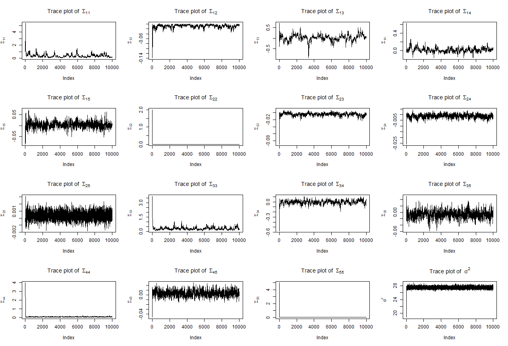
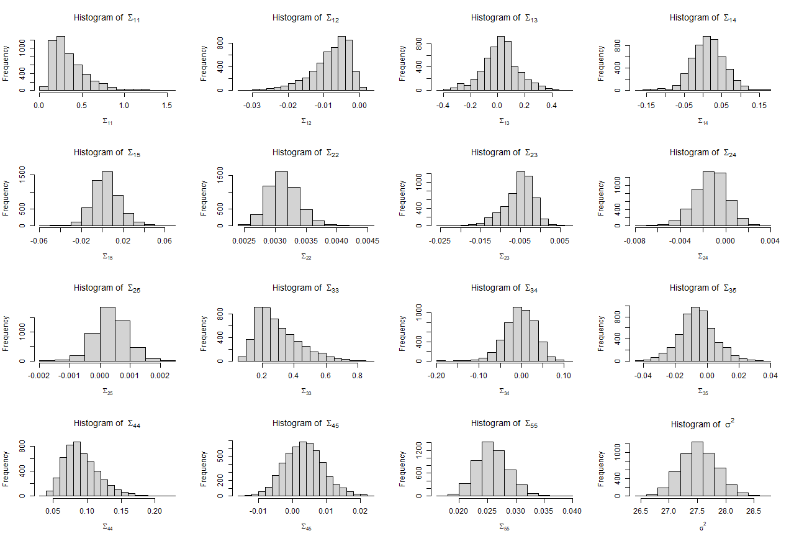
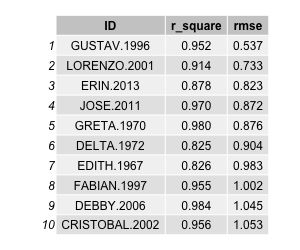
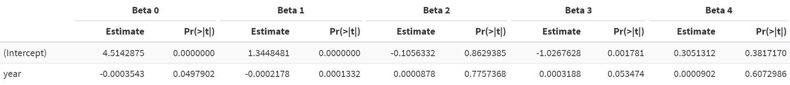

# Introduction
* Hurricanes can result in death and economical damage
* There is an increasing desire to predict the speed and damage of the hurricanes
* Use Bayesian Model and Markov Chain Monte Carlo algorithm
  + Predict the wind speed of hurricanes
  + Study how hurricanes is related to death and financial loss

# Dataset

* Hurrican703 dataset: 22038 observations $\times$ 8 variables 
  + 702 hurricanes in the North Atlantic area in year 1950-2013 with tra
  
* Processed dataset: add 5 more variables into hurrican703

* Hurricanoutcome2 dataset: 43 observations $\times$ 14 variables

# EDA - Count of Hurricanes in Each Month

```{r, include = FALSE}
library(ggplot2)
dt= read.csv("./hurrican703.csv")
library(data.table)
dt <- as.data.table(dt)
summary(dt)

library(tidyverse)
dt_long <- dt %>%
    dplyr::group_by(ID) %>% 
    mutate(Wind_prev = lag(Wind.kt, 1),
           Lat_change = Latitude - lag(Latitude, 1),
           Long_change = Longitude - lag(Longitude, 1),
           Wind_prev_prev = lag(Wind.kt, 2)) %>% 
    mutate(Wind_change = Wind_prev - Wind_prev_prev)
```

```{r, echo=FALSE}
storms_month_name = distinct(group_by(select(dt_long, Month, ID), Month))

storms_month_name %>% 
  dplyr::group_by(Month) %>% 
  mutate(Month =  factor(Month, levels = month.name)) %>%  
  ggplot(aes(x = Month)) +
  geom_bar()
```

# EDA - Average Speed (knot) of Hurricanes in Each Month

```{r, echo=FALSE}
dt_long %>% 
  dplyr::group_by(Month) %>% 
  mutate(avg_speed = mean(Wind.kt)) %>% 
  distinct(Month, avg_speed) %>% 
  mutate(Month =  factor(Month, levels = month.name))%>% 
  ggplot(aes(x = Month, y = avg_speed)) +
  geom_point() +
  scale_y_continuous("Average Speed (knot)")
```

# EDA - Count of Hurricanes in Each Year

```{r, echo=FALSE}
storms_season_name = distinct(group_by(select(dt_long, Season, ID), Season))
ggplot(data = storms_season_name) + 
  geom_bar(aes(x = Season)) +
  scale_x_continuous("Year")
```

# EDA - Average Speed (knot) of Hurricanes in Each Year

```{r, echo=FALSE}
dt_long %>% 
  dplyr::group_by(Season) %>% 
  mutate(avg_speed = mean(Wind.kt)) %>% 
  distinct(Season, avg_speed) %>% 
  ggplot(aes(x = Season, y = avg_speed)) +
  geom_point() +
  geom_smooth(method = "loess") +
  scale_y_continuous("Average Speed (knot)") +
  scale_x_continuous("Year") 
```

# EDA - Count of Hurricanes in Each Nature

```{r, echo=FALSE}
storms_nature_name = distinct(group_by(select(dt_long, Nature, ID), Nature))
ggplot(data = storms_nature_name) + 
  geom_bar(aes(x = Nature))
```

# EDA - Average Speed (knot) of Hurricanes in Each Nature

```{r, echo=FALSE}
dt_long %>% 
  dplyr::group_by(Nature) %>% 
  mutate(avg_speed = mean(Wind.kt)) %>% 
  distinct(Nature, avg_speed) %>% 
  ggplot(aes(x = Nature, y = avg_speed)) +
  geom_point() +
  scale_y_continuous("Average Speed (knot)")
```

# Bayesian Model Setting

## Model

The suggested Bayesian model is
$$Y_{i}(t+6) =\beta_{0,i}+\beta_{1,i}Y_{i}(t) + \beta_{2,i}\Delta_{i,1}(t)+
\beta_{3,i}\Delta_{i,2}(t) +\beta_{4,i}\Delta_{i,3}(t)  + \epsilon_{i}(t)$$ 

where

- where $Y_{i}(t)$ the wind speed at time $t$ (i.e. 6 hours earlier),  $\Delta_{i,1}(t)$, $\Delta_{i,2}(t)$ and $\Delta_{i,3}(t)$ are the changes of latitude, longitude and wind speed between $t$ and $t-6$, and $\epsilon_{i,t}$ follows a  normal distributions with mean zero and variance $\sigma^2$, independent across $t$. 

- $\boldsymbol{\beta}_{i} =  (\beta_{0,i},\beta_{1,i},...,\beta_{5,i})$, we assume that $\boldsymbol{\beta}_{i} \sim N(\boldsymbol{\mu}, \boldsymbol{\Sigma}_{d\times d})$, where $d$ is dimension of $\boldsymbol{\beta}_{i}$.

## Priors

$$P(\sigma^2) \propto \frac{1}{\sigma^2};\quad P(\boldsymbol{\mu})\propto 1;\quad P(\Sigma^{-1}) \propto 
|\Sigma|^{-(d+1)} \exp(-\frac{1}{2}\Sigma^{-1})$$

## Posterior

- Derive $\pi(\boldsymbol{\Theta} |\boldsymbol{Y})$, where $\Theta = (\textbf{B}^\top, \boldsymbol{\mu}^\top, \sigma^2, \Sigma), \ \textbf{B} = (\boldsymbol{\beta}_1^\top,..., \boldsymbol{\beta}_n^\top)^\top$


# Joint posterior

## Notations

- $\boldsymbol{X}_i(t)\boldsymbol{\beta}_i^\top = \beta_{0,i} + \beta_{1,i}Y_i(t) + \beta_{2,i}\Delta_{i,1}(t) + \beta_{3,i}\Delta_{i,2}(t) + \beta_{4,i}\Delta_{i,3}(t)$

- For $i^{th}$ hurricane, there may be $m_i$ times of record (excluding the first and second observation), let
$$\boldsymbol{Y}_i = 
\begin{pmatrix}
Y_i(t_0+6)\\
Y_i(t_1+6)\\
\vdots\\
Y_i(t_{m_i-1}+6)
\end{pmatrix}_{m_i\times 1}
$$
- Hence, $\boldsymbol{Y}_i \mid \boldsymbol{X}_i, \boldsymbol{\beta}_i, \sigma^2 \sim N(\boldsymbol{X}_i\boldsymbol{\beta}_i^\top, \sigma^2 I)$

- Where, $\boldsymbol{X}_i$ is a ${m_i\times d}$ dimensional matrix
$$
\boldsymbol{X}_i = 
\begin{pmatrix}
1 & Y_i(t_0)& \Delta_{i,1}(t_0) &\Delta_{i,2}(t_0) &\Delta_{i,3}(t_0)\\
1 & Y_i(t_1)& \Delta_{i,1}(t_1) &\Delta_{i,2}(t_1) &\Delta_{i,3}(t_1)\\
\vdots&\vdots&\vdots&\vdots&\vdots\\
1 & Y_i(t_{m_i-1})& \Delta_{i,1}(t_{m_i-1}) &\Delta_{i,2}(t_{m_i-1}) &\Delta_{i,3}(t_{m_i-1})
\end{pmatrix}
$$ 

# Joint posterior

## Posterior

$$
\begin{aligned}
\pi(\boldsymbol{\Theta} |\boldsymbol{Y}) & =\pi(\textbf{B}^\top, \boldsymbol{\mu}^\top, \sigma^2, \boldsymbol{\Sigma}\mid Y) \\
&\propto \underbrace{\prod\limits_{i=1}^{n} f(\boldsymbol{Y}_i\mid\boldsymbol{\beta}_i,  \sigma^2 )}_{\text{likelihood of } \boldsymbol{Y}}\underbrace{\prod\limits_{i=1}^{n}\pi(\boldsymbol{\beta}_i \mid \boldsymbol{\mu},  \boldsymbol{\Sigma})}_{\text{distribution of }\textbf{B}}\underbrace{P(\sigma^2)P(\boldsymbol{\mu})P(\boldsymbol{\Sigma}^{-1})}_{\text{priors}}\\
&\propto \prod_{i=1}^n \Big\{(2\pi\sigma^2)^{-m_i/2} \exp\big\{-\frac{1}{2}(\boldsymbol{Y}_i - \boldsymbol{X}_i\boldsymbol{\beta}_i^\top)^\top (\sigma^2 I)^{-1}(\boldsymbol{Y}_i - \boldsymbol{X}_i\boldsymbol{\beta}_i^\top)\big\}\Big\} \\ 
& \times \prod_{i=1}^n \Big\{\det(2\pi\boldsymbol{\Sigma})^{-\frac{1}{2}} \exp\big\{-\frac{1}{2}(\boldsymbol{\beta}_i - \boldsymbol{\mu}) \boldsymbol{\Sigma}^{-1}(\boldsymbol{\beta}_i - \boldsymbol{\mu})^\top\big\}\Big\} \\
&\times \frac{1}{\sigma^2} \times \det(\boldsymbol{\boldsymbol{\Sigma}})^{-(d+1)} \exp\big\{-\frac{1}{2}\boldsymbol{\Sigma}^{-1}\big\}
\end{aligned}
$$


# MCMC Algorithm

## Conditional Posterior

* To apply MCMC using Gibbs sampling, we need to find conditional posterior distribution of each parameter, then we can implement Gibbs sampling on these conditional posterior distributions.

    + $\pi(\textbf{B} | \boldsymbol{Y}, \boldsymbol{\mu}^\top, \sigma^2, \boldsymbol{\Sigma})$ 

    + $\pi(\sigma^2|\boldsymbol{Y},\textbf{B}^\top, \boldsymbol{\mu}^\top,\boldsymbol{\Sigma})$
    
    + $\pi(\boldsymbol{\Sigma} |\boldsymbol{Y},\textbf{B}^\top , \boldsymbol{\mu}^\top,\boldsymbol{\sigma^2})$
    
    + $\pi(\boldsymbol{\mu} | \boldsymbol{Y},\textbf{B}^\top  ,\boldsymbol{\sigma^2}, \boldsymbol{\Sigma})$
    
    
# MCMC Algorithm - Conditional Posterior 

- $\boldsymbol{\beta}_i$: $\pi(\boldsymbol{\beta}_i |\boldsymbol{Y}, \boldsymbol{\mu}^\top, \sigma^2, \boldsymbol{\Sigma})\sim  \mathcal{N}(\hat{\boldsymbol{\beta}}_i, \hat{\boldsymbol{\Sigma}}_{{\boldsymbol{\beta}}_i})$
    + where $\hat{\boldsymbol{\beta}}_i = (\boldsymbol{\Sigma}^{-1} + \boldsymbol{X}_i^\top(\sigma^2 I)^{-1}\boldsymbol{X}_i)^{-1}\boldsymbol{Y}_i^\top(\sigma^2 I)^{-1}\boldsymbol{X}_i+\boldsymbol{\mu}\boldsymbol{\Sigma}^{-1}, \hat{\boldsymbol{\Sigma}}_{{\boldsymbol{\beta}}_i} = (\boldsymbol{\Sigma}^{-1} + \boldsymbol{X}_i^\top(\sigma^2 I)^{-1}\boldsymbol{X}_i)^{-1}$
    
- $\sigma^2$: $\pi(\sigma^2|\boldsymbol{Y},\textbf{B}^\top, \boldsymbol{\mu}^\top,\boldsymbol{\Sigma})\sim IG(\frac{1}{2}\sum\limits_{i=1}^{n} m_i,\frac{1}{2}\sum\limits_{i=1}^{n}(\boldsymbol{Y}_i - \boldsymbol{X}_i\boldsymbol{\beta}_i^\top)^\top(\boldsymbol{Y}_i - \boldsymbol{X}_i\boldsymbol{\beta}_i^\top))$

- $\boldsymbol{\Sigma}$: $\pi(\boldsymbol{\Sigma} |\boldsymbol{Y},\textbf{B}^\top , \boldsymbol{\mu}^\top,\boldsymbol{\sigma^2})\sim IW(n+d+1,\  \boldsymbol{I}+\sum\limits_{i=1}^{n}(\boldsymbol{\beta}_i - \boldsymbol{\mu})(\boldsymbol{\beta}_i - \boldsymbol{\mu})^\top)$

- $\boldsymbol{\mu}$: $\pi(\boldsymbol{\mu} | \boldsymbol{Y},\textbf{B}^\top  ,\boldsymbol{\sigma^2}, \boldsymbol{\Sigma})\sim \mathcal{N}(\frac{1}{n}\sum\limits_{i=1}^{n}\boldsymbol{\beta}_i,\frac{1}{n}\boldsymbol{\Sigma})$

# MCMC Algorithm - Parameter Updates

The update of parameters is component wise, at $(t+1)^\text{th}$ step, updating parameters in the following the order:

1. Sample $\textbf{B}^{(t+1)}$, i.e., sample each $\boldsymbol{\beta}_i^{(t+1)}$ from $\mathcal{N}(\hat{\boldsymbol{\beta}}_i^{(t)},\hat{\boldsymbol{\Sigma}}_{{\boldsymbol{\beta}}_i}^{(t)})$

2. Then, sample $\sigma^2$ from $IG(\frac{1}{2}\sum\limits_{i=1}^{n} m_i,\frac{1}{2}\sum\limits_{i=1}^{n}(\boldsymbol{Y}_i - \boldsymbol{X}_i{\boldsymbol{\beta}_i^{(t+1)}}^\top)^\top(\boldsymbol{Y}_i - \boldsymbol{X}_i{\boldsymbol{\beta}_i^{(t+1)}}^\top))$

3. Next, sample $\boldsymbol{\Sigma}^{(t+1)}$ from $IW(n+d+1,\  \boldsymbol{I}+\sum\limits_{i=1}^{n}({\boldsymbol{\beta}_i}^{(t+1)} - \boldsymbol{\mu}^{(t)})({\boldsymbol{\beta}_i}^{(t+1)} - \boldsymbol{\mu}^{(t)})^\top)$

4. Finally, sample $\boldsymbol{\mu}^{(t+1)}$ from $\mathcal{N}(\frac{1}{n}\sum\limits_{i=1}^{n}{\boldsymbol{\beta}_i}^{(t+1)},\frac{1}{n}{\boldsymbol{\Sigma}}^{(t+1)})$

# MCMC Algorithm - Inital Values

1. For initial value of $\textbf{B}$, we run multivariate linear regressions for each hurricane and use the regression coefficients $\boldsymbol{\beta}_i^{MLR}$ as the initial value for $\boldsymbol{\beta_i}$. Then, the initial value of $\textbf{B}$ can be represented as $\textbf{B}_{init} = ({\boldsymbol{\beta}_1^{MLR}}^\top,\dots,{\boldsymbol{\beta}_n^{MLR}}^\top)^\top$.

2. For initial value of $\boldsymbol{\mu}$, we take the average of ${\boldsymbol{\beta}_i^{MLR}}$, that is $\boldsymbol{\mu}_{init}= \frac{1}{n}\sum\limits_{i=1}^n{\boldsymbol{\beta}_n^{MLR}}$

3. For initial value of $\sigma^2$, we take the average of the MSE for $i$ hurricanes.

4. For initial value of $\boldsymbol{\Sigma}$, we just set it to a simple diagonal matrix, i.e. $\boldsymbol{\Sigma}_{init} = diag(1,2,3,4,5)$

# MCMC Results

## Details

- 10000 iterations

- First 5000 iterations as burn-in period

- Estimates and inferences based on last 5000 MCMC samples

# MCMC Results - Trace Plots 1  

```{r trace_mcmc, echo=FALSE, fig.cap="Trace plots of model parameters, based on 10000 MCMC sample", out.width = '80%', fig.align='center'}
knitr::include_graphics("./plots/mcmc_trace.jpg")
```

# MCMC Results - Trace Plots 2 

```{r trace_mcmc_s, echo=FALSE, fig.cap="Trace plots of variance parameters, based on 10000 MCMC sample", out.width = '80%', fig.align='center'}

```

# MCMC Results - Histograms 1  

```{r hist_mcmc, echo=FALSE, fig.cap="Histograms of model parameters, based on last 5000 MCMC sample", out.width = '80%', fig.align='center'}

```

# MCMC Results - Histograms 2

```{r hist_mcmc_s, echo=FALSE, fig.cap="Histograms of variance parameters, based on last 5000 MCMC sample", out.width = '80%', fig.align='center'}

```

# MCMC Results - Model Parameter Estimations and Inferences

```{r model_param, echo=FALSE, fig.cap="Bayesian posterior estimates for model parameters", out.width = '100%', fig.align='center'}

```

# MCMC Results - Variance Parameter Estimations and Inferences

```{r var_param, echo=FALSE, fig.cap="Bayesian posterior estimates for variance parameters", out.width = '80%', fig.align='center'}
knitr::include_graphics("./plots/variance_param.jpg")
```

# Bayesian Model Performance 


```{r predict, echo=FALSE, fig.cap="R Squared and RMSE", out.width = '90%', fig.align='center'}

```

# Bayesian Model Performance 

```{r performance, echo=FALSE, fig.cap="Actual Wind Speed vs. Predicted Wind Speed", out.width = '90%', fig.align='center'}
knitr::include_graphics("./q4_prediction_plot.png")
```

# Seasonal Difference Exploration
```{r p5_sum, echo=FALSE, fig.cap="Fitted results of beta models", out.width = '90%', fig.align='center'}

```

# Seasonal Difference Exploration
```{r p5_sum_new, echo=FALSE, fig.cap="Fitted results of beta models for only the year variable", out.width = '90%', fig.align='center'}

```

# Predictions of Damage and Deaths
## Basic plot of Damage and Deaths
```{r, echo=FALSE}
## Import and clean the data
## The basic plot of Damage and Deaths
load("beta.res.postmean.Rdata")
dat = read.csv("hurricanoutcome2.csv") %>% 
  rename(id = HurricanID)

dat$Deaths = gsub(",","",dat$Deaths)
dat$Damage = gsub("\\$", "", dat$Damage)
dat_q6 = dat %>% 
  mutate(Damage = as.numeric(Damage),
         Deaths = as.numeric(Deaths),
         Season = as.numeric(Season),
         Maxspeed = as.numeric(Maxspeed),
         Month = as.factor(Month),
         Nature = as.factor(Nature))

plot(dat_q6$Damage, xlab = "Hurricanes", ylab = "Damage", pch = 15, col = "blue")
```

# Predictions of Damage and Deaths
## Basic plot of Damage and Deaths
```{r, echo=FALSE}
plot(dat_q6$Deaths, xlab = "Hurricanes", ylab = "Deaths", pch = 15, col = "red")
```


# Coefficient Table
```{r coef_table, echo=FALSE, fig.cap="Fitted results of beta models", out.width = '90%', fig.align='center'}

```

# Predict Damage
```{r damage, echo=FALSE, fig.cap="Coefficients of damage prediction model", out.width = '90%', fig.align='center'}

```

# Predict Deaths
```{r deaths, echo=FALSE, fig.cap="Coefficients of deaths prediction model", out.width = '70%', fig.align='center'}

```